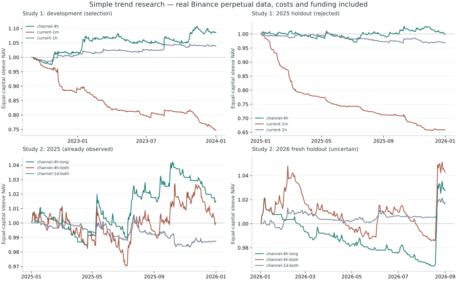

# 简洁趋势策略：跨品种研究结果

研究日期：2026-10-02。使用真实 Binance USDT 永续档案，非合成行情。

结论：4 小时只做多通道方案值得继续模拟验证，观察到扣成本后的正期望；两轮研究均未满足预先声明的全部通过条件，不能称为已证实的长期正期望策略。

实现候选：收盘突破此前 20 根高点，下一分钟开盘做多；入场冻结 ATR14，2 ATR 硬止损；收盘跌破此前 10 根低点，下分钟开盘退出。不开主动保本、不做分钟级追踪、不补仓，不预测行情。保留每笔 0.5% 风险、95% 名义敞口上限、连亏三次冷却与单日 3% 限制。

## 研究方法

- 品种：BTC、ETH、BNB、SOL、XRP、DOGE。每个独立账户初始 10,000 USDT；等额分仓收益是六账户期末资金的平均，无跨账户保证金或动态再平衡。
- 收盘信号、次分钟开盘市价成交；分钟旧止损先检查。单边手续费 5 bps、滑点 2 bps、保守价格取整，扣除真实资金费；压力情形费用和滑点均翻倍。
- 窗口及资金费按 UTC；每段重新开始账户并使用 30 天预热，区间末尾带成本平仓。阶段之间不连接持仓；曲线也不拼接成连续实盘记录。
- 第一轮六个规则先冻结，按开发期各品种平均净 R 的中位数选出 4 小时双向通道；验证期和 2025 保留期可否定它，不可调优它。
- 第一轮未通过后，第二轮仅比较 4 小时／日线 × 双向／只做多，仍只按开发样本选择。此前已查看的 2024／2025 明确降为诊断；2026 年 1–8 月是唯一新的保留期。第二轮之后不继续搜索。
- 单笔 R 与净美元期望同时报告。置信区间使用等额分仓日收益的 7 天循环块 bootstrap（2,000 次、固定随机种子），保留日间依赖；它不是收益保证，也不是 DSR。
- 两个研究级选择完整披露；仅检验冻结选择的下方 2.5% 尾，不从保留期挑最高收益。所有原始候选与邻近测试均保留在 results.json。

## 第一轮：当前策略与通道管理

| 规则 | 开发期收益 | 2024 验证收益 | 2025 保留收益 |
|---|---:|---:|---:|
| current-1m | -25.36% | -24.88% | -34.17% |
| current-15m | -21.35% | -16.45% | -21.08% |
| current-1h | 3.91% | -0.78% | -3.07% |
| channel-1h | -16.52% | -1.39% | 0.44% |
| channel-background-1h | 2.62% | -0.17% | 0.48% |
| channel-4h | 8.58% | 3.41% | -0.01% |

选中的 4 小时双向通道在 2025 年近乎持平，双倍成本后亏损；盈利品种仅 3/6。它未通过，不将邻近参数偶然盈利改称为成功。

## 第二轮：4 小时只做多候选

| 样本 | 等额分仓净收益 | 平均净 R | 单笔净期望 USDT | 利润因子 | 盈利品种 | 交易笔数 |
|---|---:|---:|---:|---:|---:|---:|
| 2022-09-01 至 2024-01-01（右端不含） | 9.57% | 0.504 | 23.441 | 1.718 | 5/6 | 245 |
| 2024-01-01 至 2024-08-01（右端不含） | 3.44% | 0.381 | 17.360 | 1.618 | 5/6 | 119 |
| 2025-01-01 至 2026-01-01（右端不含） | 1.50% | 0.100 | 4.323 | 1.154 | 4/6 | 208 |
| 2026-01-01 至 2026-09-01（右端不含） | 2.76% | 0.288 | 11.933 | 1.404 | 5/6 | 139 |

新保留期双倍成本收益 **1.90%**。标准成本日收益 Sharpe **0.724**；等额分仓日收盘最大回撤 **-5.54%**，最差单品种分钟回撤 **-8.00%**。两者频率和账户口径不同。

| 品种 | 新保留期净收益 | 平均净 R | 分钟最大回撤 | 笔数 | 标的价格涨幅（未扣成本） |
|---|---:|---:|---:|---:|---:|
| BTCUSDT | 3.86% | 0.404 | -4.18% | 23 | -10.34% |
| ETHUSDT | 4.98% | 0.453 | -5.71% | 26 | -16.96% |
| BNBUSDT | -1.76% | -0.111 | -7.44% | 27 | -20.01% |
| SOLUSDT | 4.69% | 0.476 | -6.84% | 23 | -17.32% |
| XRPUSDT | 4.46% | 0.476 | -8.00% | 21 | -25.09% |
| DOGEUSDT | 0.35% | 0.056 | -6.09% | 19 | -29.47% |

标的价格涨幅仅解释行情背景，不是扣成本或风险匹配的可交易基准；正收益不能直接解释为超额收益。

### 稳定性与未通过原因

- 新保留期日平均收益的 95% 块 bootstrap 区间为 **[-2.858, 7.002] bps / 日**，跨过零，无法排除不存在优势的情况。
- 新保留期共 139 笔，每品种 19–27 笔，未达到冻结的每品种 30 笔门槛。六种加密资产相关，不能把它们当作六个独立市场。
- 盈利最大的 5% 交易贡献 **72.19%** 的总正利润；删去这些交易后净盈亏为 **-2502.74 USDT**。这是尾部依赖诊断，不证明策略必然无效；过早止盈可能损害这种分布。
- 相邻参数只检验是否陡峭失效，不重新挑最优点。增加参数、事后挑币或改变亏损日期均不用于修饰结果。

| 新保留期邻近测试 | 净收益 | 平均净 R | 盈利品种 |
|---|---:|---:|---:|
| channel-4h-long | 2.76% | 0.288 | 5/6 |
| channel-4h-long-stress | 1.90% | 0.230 | 4/6 |
| channel-4h-long-window-half | 3.50% | 0.225 | 5/6 |
| channel-4h-long-window-double | 2.09% | 0.375 | 5/6 |
| channel-4h-long-stop-lower | 1.82% | 0.196 | 4/6 |
| channel-4h-long-stop-higher | 2.33% | 0.246 | 4/6 |

## 数据质量与局限

部分月档案缺失整日，可用校验后的官方日 ZIP 完整替换相应日期，原始月档案不改写。2022-07 与 2024-08 的少量标记价格在日档案中也缺失，因此在任何成功收益计算前按数据完整性缩短窗口：开发期从 2022-09-01 开始，验证期截至 2024-08-01。资金费不补零、行情不插值。2026-06 缺失标记价格整日也从官方日档案恢复。

冻结 plan、输入 SHA-256、合并来源、原始结果哈希及完整候选矩阵保存在 [results.json](results.json)。原始 CSV 缓存在 ~/.cache/bcr-trend-research；完整账本、分阶段冻结选择和回放输入保存在 tmp/trend-research 与 tmp/trend-slow。

这些是存活且较流动的加密永续品种，存在生存者选择；不是股票、商品、债券之间的分散。静态精度是保守假设，未重建历次交易所过滤器。分钟 OHLC 不包含历史盘口、冲击、强平、ADL或断线成交；没有实盘可靠性证据。历史隔离不等于前瞻交易。

## 使用与下一步

Quant Lab → 永续趋势 → 参数 →「使用简洁通道方案 · 4 小时 / 仅做多」→ 应用。预设保留当前资金、成本和风控设置；更换交易对需核对合约精度。结果中展开「收益质量与交易管理」，可查看净期望、盈亏比、风险调整收益、持仓／换手、多空贡献、最大交易依赖和退出分布。旧配置只升级可编辑草稿，历史结果保持原样。

优先继续前向模拟，固定这四个核心选择（4 小时、20 根、2 ATR、只做多），累积更多交易；记录真实滑点与资金费，再检验同一门槛。若失败就否定假设，不在同一保留期继续搜索。实盘账户状态持久化、重启对账、独立心跳与退出执行是另一个工程阶段，本次只实现历史研究与确定性管理，不声称已具备实盘交易系统。

## 参考

[AQR 长期趋势研究](https://www.aqr.com/insights/research/journal-article/a-century-of-evidence-on-trend-following-investing)支持从多市场、多时期与成本口径研究趋势；不能直接外推成加密短线策略有效。

[Bailey 与 López de Prado：Deflated Sharpe Ratio](https://www.davidhbailey.com/dhbpapers/deflated-sharpe.pdf)讨论重复试验的选择偏差。这里完整披露两轮、拒绝失败假设，并保留新的测试区间；未把短样本 Sharpe 当作策略获利的证明。

[Binance 官方历史档案说明](https://github.com/binance/binance-public-data)提供月／日 ZIP 与 CHECKSUM；实际研究额外验证分钟连续性。
