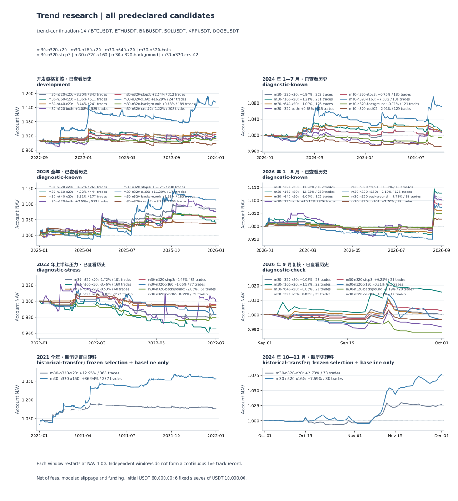

# 30 分钟趋势策略：机制拆分与历史转移验证

**得到一个通过本轮预定历史转移门槛的候选：320 根收盘突破、2 ATR 初始止损、160 根反向通道退出，仅做多。** 改善主要来自保留少数持续盈利的趋势，胜率反而下降。它仍在 2022 上半年和最近的 2026 年 9 月亏损，在 2026 年前八个月也弱于原退出规则；当前证据足以支持冻结参数后的前向观察，不能证明未来或所有市场状态的正期望。

这次使用八个预声明方案、六个已知历史窗口，以及两个此前未在项目中做过策略评价的历史转移窗口。开发期只选一次，其余候选没有在新窗口运行。未按结果追加组合、阈值或重新选择赢家。

## 当前候选的精确定义

| 模块 | 冻结规则 |
|---|---|
| 市场与周期 | Binance USDT 永续；BTC、ETH、BNB、SOL、XRP、DOGE；UTC 30 分钟 |
| 突破 | 收盘价 ≥ 此前 320 根完整 K 线最高价 + 1 tick；不含当前信号 K，观察长度 160 小时 |
| 成交与重入 | 信号形成后的下一分钟开盘，以不利滑点和价格取整成交；每个新完成收盘可重新发信号，仍受持仓和风控限制 |
| 初始风险 | 信号收盘的 Wilder ATR14，距实际入场 2 ATR 的硬止损；R 按实际入场到初始止损冻结 |
| 退出 | 收盘严格跌破此前 160 根完整 K 线最低价，下一分钟开盘退出；观察长度 80 小时 |
| 持仓保护 | 硬止损始终按分钟监控；保本、ATR 跟踪、固定盈利目标关闭；允许跨日 |
| 仓位 | 总资本 60000 USDT，六个固定独立子账户各 10000；每笔子账户风险 0.5%，名义敞口上限 95% |
| 风控 | 各子账户连亏三次冷却 60 分钟；分钟收盘标记权益较自身 UTC 日初权益下跌 3% 时，次分钟平仓并停止当日新开仓 |
| 成本 | 正常每边手续费 5 bps、滑点 2 bps，另计历史资金费；压力每边 10／4 bps，完整重放 |

通道退出是一条持续移动的退出条件，不是达到固定盈利后才启动的“第三档”。本轮不叠加 1R 保本或固定 2R 止盈，也没有在这个新组合上验证它们优劣。30 分钟是信号计算周期，不代表短持仓：候选的平均持仓常在两至三天，而大量失败交易仍较早被初始止损结束。

## 选择过程与全部历史表现

开发期为 2022-09-01 至 2024-01-01。六项选择池要求每币至少 30 笔且日收益 Sharpe 有限，按 Sharpe 选一次，并列按计划顺序。背景过滤、成本门槛因部分币样本不足而不合格；其余四项中 320／160 的 Sharpe 为 1.367，最高。六币交易数为 35／34／44／40／43／51，五币盈利，中位单币净 R 为 0.804，通过另列的开发资格。160／640 根入场只作稳定性诊断，始终不参加选择。

下表为相同初始资金下的正常／压力净收益，均包含费用、模拟滑点和历史资金费。每段独立重置资金，不可将这些收益连乘为连续投资业绩。

| 窗口 | 320／20 基准 | 320／160 冻结候选 | 候选交易数 | 候选正常成本日终最大回撤 |
|---|---:|---:|---:|---:|
| 开发期 2022-09 至 2023-12〔已知〕 | +3.30%／未测 | +16.29%／未测 | 247 | -6.72% |
| 2024 年 1—7 月〔已知〕 | +0.94%／-0.60% | +7.08%／+5.16% | 138 | -4.71% |
| 2025 全年〔已知〕 | +8.37%／+5.30% | +11.29%／+8.11% | 173 | -5.00% |
| 2026 年 1—8 月〔已知〕 | +11.22%／+8.31% | +7.19%／+4.96% | 125 | -8.22% |
| 2022 上半年〔已知压力〕 | -1.72%／-2.14% | -1.66%／-1.92% | 77 | -3.01% |
| 2026 年 9 月〔已知〕 | +0.03%／-0.20% | -0.31%／-0.44% | 21 | -1.73% |
| 2021 全年〔新历史反向转移〕 | +12.95%／+10.80% | +36.94%／+35.46% | 237 | -3.33% |
| 2024 年 10—11 月〔新历史转移〕 | +2.73%／+2.20% | +7.69%／+7.17% | 38 | -1.44% |

新窗口均按冻结方案评价：2021 是早于开发期的反向历史转移，不能称作时间顺序上的样本外；2024 年 10—11 月晚于开发期，但只有 61 天、38 笔。两个窗口都属于回溯历史，不是研究冻结以后新到达的行情或实盘。

## 正期望证据到什么程度

两段转移共 426 个观测日，正常成本 275 笔，样本单笔平均净收益／平均净 R 为 **97.38 USDT／1.797 R**；压力成本 274 笔，为 **93.34 USDT／1.795 R**。这些是样本净期望估计，并非未来总体期望的已知值。不同成本情景会改变数量、账户风险状态和后续机会，因此不是对原交易账本简单重复扣费。

先合计六个子账户的完整日权益，再独立计算每个窗口的日收益；汇总日均收益按 365／61 天加权。块只在各自窗口内循环抽取，同一日期配对全部币种、候选和成本情景。以下为 2000 次重采样，种子 20261003，单位 bps／日。

| 块长度 | 候选正常日均收益 95% 区间 | 候选压力日均收益 95% 区间 | 正常成本相对基准差 95% 区间 | 压力成本相对基准差 95% 区间 |
|---|---|---|---|---|
| 7 日 | [+3.965, +15.645] | [+3.760, +15.144] | [+2.193, +9.953] | [+2.473, +10.035] |
| 28 日 | [+3.335, +16.327] | [+3.097, +15.637] | [+1.661, +10.707] | [+1.928, +10.734] |

正常／压力日均点估计分别为 9.302／8.920 bps。两种块长的绝对区间下界均大于零，开发资格、样本数、逐币交易数、两窗正常及压力净收益、两窗日终回撤上限也满足预定条件，机器状态为 `passed-for-forward-observation`。所有 28 项检查及逐窗值见 [transfer-evaluation.json](transfer-evaluation.json)。相对差区间另列描述；正式区间验收使用候选自身的绝对下界，没有用相对改善替代绝对盈利。

**该判断仅针对这些历史窗口与假设。** 2021 占 85.7% 的观测日，是汇总证据的主要来源；2024 两个月单独的七日块正常日均区间约为 **[−0.408, +28.343] bps**，仍跨零。不能把池化区间解释为后一个窗口也已单独证明正期望。7／28 日块对序列依赖和稳定性的假设未被证明，整个项目过去的试验次数也未由这些区间校正。

此前文献实验的“四个方案均未通过原接受门槛”结论保持不变。本轮采用的是结果生成前另行冻结的选择与转移门槛，并不把旧研究改判为成功。如果沿用旧“所有已知诊断区间都赚钱”的严格要求，新候选同样失败。

## 退出改善了什么，准确率是否提高

以两个新窗口说明，胜率由完整交易的净盈亏定义，受退出策略影响，不能当成独立突破信号准确率。

| 指标 | 2021 基准 | 2021 慢退出 | 2024 年 10—11 月基准 | 2024 年 10—11 月慢退出 |
|---|---:|---:|---:|---:|
| 完成交易 | 363 | 237 | 73 | 38 |
| 净胜率 | 31.13% | 17.30% | 32.88% | 31.58% |
| 平均盈利 USDT | 180.72 | 831.73 | 158.69 | 491.08 |
| 平均亏损 USDT | -50.61 | -60.90 | -44.29 | -49.14 |
| 净 PF | 1.614 | 2.857 | 1.755 | 4.612 |
| 单笔净期望 USDT | 21.40 | 93.52 | 22.44 | 121.45 |
| 平均持仓小时 | 16.85 | 58.55 | 17.54 | 84.94 |
| 持仓中位小时 | 11.50 | 13.45 | 13.00 | 15.37 |
| 成本前平均 R | 0.5327 | 1.9405 | 0.5595 | 2.6966 |
| 平均成本 R | 0.1148 | 0.2544 | 0.1210 | 0.2078 |
| 平均净 R | 0.4179 | 1.6862 | 0.4385 | 2.4888 |
| 资金费净支出 USDT | 946.81 | 2,414.24 | 62.16 | 168.41 |
| 全部成本 USDT | 2,126.93 | 3,279.12 | 397.78 | 358.29 |

2021 胜率从 31.13% 降至 17.30%，但平均盈利扩大到约 831.73 USDT，足以覆盖频繁的小亏损；净 PF 从 1.614 提高到 2.857。成交减少并未让总成本降低：资金费从 946.81 增至 2414.24 USDT，总成本反而增加。收益改善主要表现为更大的盈利尾部，而非更高命中率或更低费用。

**原有日亏损风控也是完整退出政策的重要部分。** 各子账户在 UTC 每日首分钟用标记开盘价估值作为自身日初权益；分钟收盘权益跌至其 97% 时安排次分钟平仓。因此跨日盈利仓位也可能以 `daily-loss` 结束，名称不代表这笔交易最终亏损。2021 候选的 15 笔此类退出合计净赚 22984.82 USDT；31 笔通道退出合计 +11003.21，191 笔初始止损合计 −11823.18。不能把全部改善归于通道触发，移除这层风控也不再是已验证的方案。2024 两个月另有两笔在区间终点强制平仓，合计 +1780.49 USDT；短窗口结果也受结束边界影响。

2025 年慢退出也提高净收益，但日收益 Sharpe 从基准 1.555 降至 1.318，日终回撤从 −3.36% 扩大到 −5.00%；2026 年前八个月收益由 +11.22% 降至 +7.19%，回撤由 −4.16% 扩大到 −8.22%。较慢退出接受了明显回吐。它提高某些趋势期的单笔收益，并没有对原基准形成全面优势。

这些都是完整账户对照。退出改变后，仓位占用、资金规模和后续入场机会一起改变；没有把不同交易集合的均值差宣称为同一次入场的因果退出收益。持仓平均值明显变大、中位值只小幅变化，也说明改善集中在少数长持仓，而非每笔都持有更久。

## 其他细节的对照结果

每格为正常／双倍费滑净收益。全部是已知历史诊断，不能因其中某个数值更高而替换冻结选择。

| 机制 | 开发期 | 2024 年 1—7 月 | 2025 | 2026 年 1—8 月 | 2022 上半年 | 2026 年 9 月 |
|---|---:|---:|---:|---:|---:|---:|
| 320／20 基准 | +3.30%／未测 | +0.94%／-0.60% | +8.37%／+5.30% | +11.22%／+8.31% | -1.72%／-2.14% | +0.03%／-0.20% |
| 160／20 稳定性 | +1.86%／未测 | +1.21%／-0.98% | +4.22%／+0.27% | +12.73%／+8.00% | -3.46%／-4.16% | +1.57%／+1.18% |
| 640／20 稳定性 | +3.44%／未测 | +1.00%／+0.06% | +3.61%／+1.71% | +6.07%／+4.62% | -0.53%／-0.81% | +0.05%／-0.11% |
| 320／20 双向 | +1.08%／未测 | +0.63%／-1.59% | +7.55%／+3.00% | +10.12%／+5.95% | -0.03%／-1.74% | -0.83%／-1.07% |
| 320／20 止损 3 ATR | +2.54%／未测 | +0.75%／-0.21% | +5.77%／+4.13% | +8.50%／+6.71% | -0.43%／-0.74% | +0.28%／+0.13% |
| 320／160 慢退出 | +16.29%／未测 | +7.08%／+5.16% | +11.29%／+8.11% | +7.19%／+4.96% | -1.66%／-1.92% | -0.31%／-0.44% |
| 320／20 背景过滤 | +0.83%／未测 | -0.71%／-1.55% | +5.93%／+3.92% | +4.78%／+3.73% | -2.06%／-2.30% | -1.19%／-1.23% |
| 320／20 成本门槛 0.2 | -1.22%／未测 | -2.91%／-1.32% | +3.75%／-0.97% | +2.70%／-0.65% | -0.79%／-0.86% | -0.34%／+0.01% |

- **突破长度：** 160／320／640 根的 2025、2026 年前八个月正常及压力净收益均为正，但开发期及 2024 年更薄弱，2022 上半年全部为负。可以支持“长窗口附近有部分同向表现”，不足以证明 320 是最优值；三个窗口分别预热 4／7／14 天，包含已披露的初始 Wilder ATR 种子差异。
- **做空：** 双向版本仅在 2022 上半年从空头获得正净贡献，约 +1032.88 USDT，仍未完全覆盖多头亏损；账户正常 −0.03%、压力 −1.74%。其他五个已知窗口空头净亏，且空头不一定收取资金费。没有将做空加入所选方案。
- **初始止损：** 3 ATR 在 2024 年将初始止损占比从 59.4% 降至 38.3%，但净收益从 +0.94% 降至 +0.75%；2022 亏损收窄但没有转正。更宽止损也按相同风险预算减仓，R 分母随之改变，不能仅看止损次数和成本 R。
- **背景过滤：** 复用已有的 2 小时 EMA 斜率、效率及确认结构复合门槛，没有稳定提升结果，并在开发期因部分币交易不足而不参与最终排名。这不是简单 EMA 单因素实验。
- **成本门槛：** 0.2 ATR 门槛降低了部分成本，但开发期及 2024 年的成本前边际也变差。它选择高波动相对低摩擦的机会，不等于选择更会延续的趋势。压力成本会提高实际准入要求，例如 2025 年交易由 156 降至 20，不能把某些压力收益改善解释为费用越高越好。

所有逐币、成本情景及未运行记录见 [REPORT.md](REPORT.md)，交易质量、方向与成本归因见 [diagnostics.json](diagnostics.json)。新转移窗口没有运行这些淘汰方案，缺失结果不是零收益。

## 集中度、市场覆盖与前向观察

2021 年 DOGE 子账户净利润 11977.97 USDT，占该窗组合净利润约 54.0%；正常成本最盈利约 5% 的交易贡献正交易利润的 71.5%。2024 两个月只有 38 笔，最盈利五笔贡献正交易利润的 80.4%。趋势策略依赖尾部并非自动失效，但意味着错过少数行情、成交滑点或持仓纪律变化会显著影响结果。

预声明的逐币剔除诊断中，省去任意一个固定子账户后，转移池化日均点估计仍为正；省去 DOGE 时，正常／压力分别约 6.005／5.727 bps／日。此项只是五个剩余原分配子账户的账本合计，未重新配置资金、未重放，也没有检验剔除后统计显著性，不能据此宣称不存在集中风险。

两个新增窗口未用于本轮选择，但不是随机抽取的市场状态；2021 及 2024 年末的上涨行情不能代表未来环境。所选六个今天仍存续的币、静态价格／数量精度、分钟 OHLC 成交、独立资金子账户同样限制外推。2021 的组合日终最大回撤 −3.33%，而最差单币分钟回撤约 −15.48%，二者不能混称。本轮也未与相同波动或市场敞口的买入持有组合比较，不能由绝对盈利推断市场超额收益。

下一项最有价值的验证是保持当前规则和六币集合不变，记录真正新到达行情中的信号、可成交价格、资金费及净权益，并把实际费用与本轮压力假设对账。本轮不继续寻找更高胜率阈值、不按 DOGE 盈利重新配权，也不自动替换工作台默认策略或连接实盘交易。

## 实现与核验

交易规则全部复用共享 Rust `trend-continuation-14`，本轮没有修改撮合或策略引擎。研究协议只增加新窗口的 `selected-and-baseline` 范围；转移统计独立于执行与选择，报告和图使用同一审计后账本。方向归因汇总实际交易，不另建做多／做空撮合器。

修复了一项数据边界问题：下载器原先强制预热所在整月完整，因不需要的 2020-12-17 缺口阻断了最早从 12 月 18 日开始的预热。现在对实际预热／回放要求保持完整日检查，必要时只用官方完整日档案恢复；范围外原始行保持不变，再将实际连续范围投影成价格与标记价格对齐的可追溯回放文件。缺任何所需分钟仍拒绝运行，没有补造行情、换日期或更换币种。

计划中继承的 `excludedIntervals / scope` 描述指旧研究，而本轮显式 `windows` 已新增 2024 年 10—11 月。冻结计划原字节未改，元数据勘误与修复阶段记录在 [protocol-notes.json](protocol-notes.json)，实际要求和档案恢复记录见 [data-quality.json](data-quality.json)。

核验覆盖 **48 个品种窗口批次、576 个成本候选行、15725 笔完成交易、908 个源文件哈希**。包括双向此前高低边界、信号 ATR、次分钟成交、初始风险、数量、费用与资金费，以及初始止损／通道退出顺序。66 个旧 N320 正常／压力结果的配置、预热、交易、日权益及指标严格一致。派生片段逐行核对父源，见 [execution-audit.json](execution-audit.json)。这些笔数包含重复候选与成本路径，不是独立统计样本数量。

补充的[日亏损触发审计](risk-trigger-audit.json)从已成交账本独立重建 191047680 个账户分钟的现金和标记权益，对齐全部日权益与期末现金。104 笔日亏损退出均在持仓首次越过日初 97% 权益线后的下一分钟执行，其中 103 笔交易最终仍盈利；跨日浮盈回吐的合成反例及延迟退出拒绝也通过。[审计附件脚本](risk-trigger-audit.py)可复算此结果，不产生新信号或替代生产撮合器。

这些核验仍没有独立重放背景过滤、冷却、日内禁入后的新开仓资格及未成交拒绝。开发选择和转移均值／回撤／块区间另以独立实现复算，见 [independent-evaluation-audit.json](independent-evaluation-audit.json)。108 项 Python 测试及仓库 check 通过（0 errors，35 项已有 lint 警告），其中 Python 包含冻结 release 二进制的两段不连续月份输入测试；原有冻结文件哈希未变。

复现命令见 [研究文档](../../../docs/BINANCE-TREND.md#机制拆分与历史转移)。[冻结计划](../details-plan.json) SHA-256：`c7c302e8d4acaed4b1e7222e98b8b5fd8471207105ea30b25552fb3a7e21fa38`；本轮原始回放位于 `tmp/trend-details-v8`。每项产物保留计划、输入、选择与源码身份。

## 文献依据及适用范围

1. [Lo 与 Remorov，2017](https://www.sciencedirect.com/science/article/pii/S1386418117300472)：止损效果依赖收益过程与交易成本，紧止损可能因频繁交易而失效。其美国股票理论与实证支持做宽止损对照，不提供 30 分钟币圈的最优 ATR 倍数。
2. [de Lataillade 等，2012](https://arxiv.org/abs/1203.5957)：特定预测过程、线性交易成本及仓位约束下存在交易阈值／不交易区域。它提供降低无效换手的机制动机，不证明 320／160 参数有效。
3. [Fieberg、Liedtke、Zaremba，2024](https://www.sciencedirect.com/science/article/pii/S1057521924001509)：加密横截面动量需考虑做空可行性、成本和收益随时间变化。这不是单币 30 分钟通道策略；本轮做空结果未支持把横截面发现直接移植过来。
4. [Bailey 与 López de Prado，2014](https://www.davidhbailey.com/dhbpapers/deflated-sharpe.pdf)：重复尝试、选择最高表现及反复使用留出集会夸大结果。本轮保留八组全部结果、只在新窗口检验一次冻结选择，但仍未消除项目累积选择偏差，不把普通块区间称为 DSR 校正。

另筛查了两篇新预印本：[15 分钟均值回归研究](https://arxiv.org/html/2608.21888v1)存在留出期内按成交量选样及毛边际／现货成本口径问题；[AdaptiveTrend](https://arxiv.org/html/2602.11708v1)使用当前收盘信号同收盘成交、每月选币调参，且资金费／样本区间描述不一致。它们没有作为本轮新增候选或盈利结论的依据。
