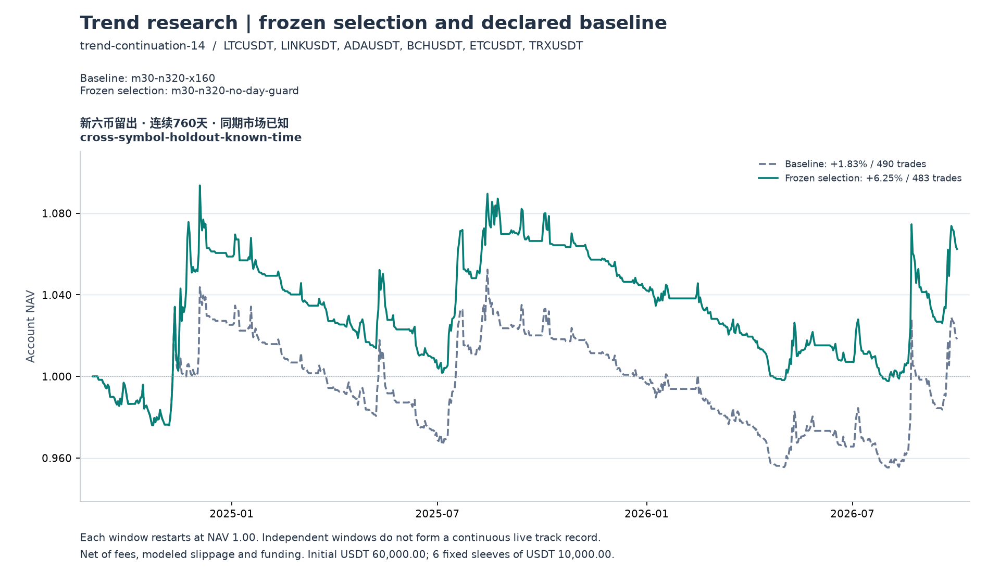

# 320 / 160 通道策略的跨品种留出验证

本轮结论为 **`not-established`：没有通过事前约定的验证门槛**。冻结候选在六个此前未参与本项目研究的币种上，760 天净收益为 **6.25%**；手续费与滑点加倍后为 **1.92%**。两种成本下的平均日收益置信区间均跨零，压力成本下日终最大回撤 **11.02%**，超过 10% 上限。账本盈利成立，但还不能确认可迁移的正期望。

这是**未研究币种的历史留出验证**。此前 BTC、ETH、BNB、SOL、XRP、DOGE 的相同历史阶段已被研究，多币共同经历相同市场行情，因此本次不属于独立时间样本外，也不是实盘结果。原研究结论没有被重写。

## 固定了什么

在读取目标行情及运行策略之前冻结了 [计划](../holdout-plan.json)、目标品种和验收条件。检查了此前 12 个研究计划、12 个原始清单及两个趋势数据缓存，目标六币没有出现在这些研究证据中；这不表示这些公开价格从未被任何人看过。

| 项目 | 本轮约定 |
|---|---|
| 主方案 | 原冻结选择 `m30-n320-no-day-guard`，关闭日亏损退出及该模块的当日禁入 |
| 对照 | 原基线 `m30-n320-x160`，每子账户 UTC 日亏损保护 3% |
| 目标 | LTC、LINK、ADA、BCH、ETC、TRX 的 USDT 永续 |
| 时间 | 2024-09-01 至 2026-10-01，不含结束日，共 760 天 |
| 账户 | 60,000 USDT，六个各 10,000 的独立子账户；不调拨、不再平衡 |
| 预热 | 前置 7 天仅更新指标，正式区间空仓开始；全程不按年重置 |
| 成本 | 每边手续费 5 bps、滑点 2 bps；压力为 10 / 4 bps，完整重新回放；均计真实历史资金费 |
| 风险 | 每笔子账户风险 0.5%，名义敞口上限 95%，连续三亏后冷却 60 分钟 |

策略及原生二进制完全沿用原选择。多单信号是 **30 分钟收盘价超过此前 320 根最高价至少 1 tick**，通道排除当前 K 线，下一分钟开盘模拟执行。入场后硬止损依据实际成交价与信号 ATR 的两倍距离确定；30 分钟收盘跌破此前 160 根低点，下一分钟开盘退出。分钟硬止损持续有效。没有保本、ATR 跟踪或固定止盈，配置中未启用的 `trailingAtr` 不影响通道退出。每根新完成的信号 K 线可重新触发，仍受仓位及冷却限制。

320 根对应 160 小时，160 根对应 80 小时；实测平均持仓约 45.87 小时。这已经是一套允许跨日的低频趋势规则。

新币使用官方接口返回的 tick、数量步长及最小名义金额，不能机械套用旧币的精度。该快照获取于 2026-10-03 09:03:53 UTC，响应内服务器时间为 2026-10-02 11:46:29.244 UTC；完整响应及收据已保存。这是静态历史模拟约束，未重建各日交易所规则。六币是事前指定的存续合约样本，并非当时全部上市及退市合约的随机样本。

## 回测结果

以下均为扣除成本后的完整账户表现；最大回撤使用包含浮盈亏的合计日终权益，不能代替分钟组合最大回撤。Sharpe 使用连续 UTC 日收益、365 日年化、无风险利率 0。

| 方案 | 净收益 | 日终最大回撤 | Sharpe | 交易数 | 净 PF | 单笔净期望 USDT |
|---|---:|---:|---:|---:|---:|---:|
| 主方案，基础成本 | **6.25%** | **−8.77%** | **0.385** | **483** | **1.181** | **7.76** |
| 主方案，压力成本 | **1.92%** | **−11.02%** | **0.154** | **485** | **1.056** | **2.37** |
| 对照，基础成本 | 1.83% | −9.22% | 0.150 | 490 | 1.053 | 2.24 |
| 对照，压力成本 | −2.15% | −10.71% | −0.107 | 492 | 0.937 | −2.62 |

主方案基础成本 CAGR 为 2.95%、Calmar 为 0.337、平均净 R 为 0.194；压力成本下分别为 0.92%、0.083、0.060。两种成本下最长回撤持续时间均为 **666 天且期末未恢复**。基础成本胜率为 13.25%，平均盈利约 382.77 USDT、平均亏损约 49.52 USDT，平均盈亏比约 7.73；这描述完整交易的结果，不能等同于突破事件的独立预测准确率。

基础成本账本净利润 3,749.10 USDT，费用、资金费、模拟滑点及取整合计 3,679.49 USDT，消耗同一路径成本前盈亏的 **49.53%**。压力成本消耗比例升至 83.13%。这些是成交路径归因，不是零成本回测，也没有从已经扣费的净值再次减去滑点。



## 为什么没有通过

先合计六个固定子账户的美元权益，再计算日收益。以共同日期做 7 天及 28 天循环块 bootstrap，四个方案共用重采样日期，2,000 次、种子 20261003；不把相关交易当作独立样本。下表为**平均日收益**的 95% 百分位区间，单位 bps/天，不是累计收益率区间。

| 主方案 | 日均收益 | 7 天块区间 | 28 天块区间 |
|---|---:|---:|---:|
| 基础成本 | +0.895 | **[−2.112, +4.158]** | **[−1.782, +4.103]** |
| 压力成本 | +0.335 | **[−2.478, +3.361]** | **[−2.153, +3.241]** |

事前门槛要求来源研究的开发资格有效，目标至少 180 天、每种成本至少 100 笔且每币至少 10 笔；两种成本下净收益均为正、日终回撤均不超过 10%，上述四个绝对收益区间下界均大于零。24 项检查中 **5 项失败**：四个区间下界和压力回撤。数据长度与交易数量门槛均通过，因此不能将失败简单归因于“没有交易样本”。

相对原基线，主方案日均收益差为基础 +0.574 bps、压力 +0.548 bps，但配对区间同样全部跨零。关闭日亏损保护在这个样本中的点估计较好，尚不能据此确认普遍优势。此次只有一个继承的主方案，没有目标域排名或候选替换；这也没有消除原研究多次尝试的选择偏差。

## 泛化能力与收益集中度

| 组合 | 同期基础净收益 | 同期压力净收益 |
|---|---:|---:|
| 原六币，已有研究样本 | +40.88% | +32.77% |
| 新六币，本轮留出样本 | **+6.25%** | **+1.92%** |

两组沿用相同策略、单币初始资金和成本模型，但币种、价格路径及各自成交约束不同；这不是单一因素因果实验。新币收益点估计明显降低，使“320 / 160 已经稳定有效”的判断缺乏支持；本轮未检验两组收益差的统计显著性，也不能单凭这一轮就证明某个整数参数一定过拟合。

| 新币 | 基础净收益 | 压力净收益 | 基础交易数 |
|---|---:|---:|---:|
| LTC | −22.33% | −23.83% | 96 |
| LINK | +21.24% | +16.70% | 74 |
| ADA | +43.07% | +37.64% | 64 |
| BCH | −4.31% | −6.22% | 71 |
| ETC | −1.75% | −4.42% | 76 |
| TRX | +1.57% | −8.36% | 102 |

基础成本只有 3/6 币盈利，压力下只有 2/6。ADA 子账户净利润 4,307.28 USDT，超过组合全部净利润；其余五币原有子账户合计基础收益为 **−1.12%**、压力为 **−5.23%**。这里只做现有独立账本的算术分解，没有剔除币种后重新分配资金，也不据此改选 ADA。

在同一连续账户中，主方案基础成本分阶段收益为 2024 年 9—12 月 +5.88%、2025 年 −1.58%、2026 年 1—9 月 +1.96%；25 个月中仅 8 个月盈利。少数大单贡献利润符合趋势策略的可能特征，但低盈利广度、长回撤和压力成本敏感同时存在。期末强制平掉的一笔交易贡献 617.03 USDT，占基础净利润 16.46%，也应注意区间边界的影响。

## 证据完整性

[数据审计](data-quality.json)独立核对了 468 份官方 ZIP、CHECKSUM 和 CSV 成员，重算 492 个本地源文件及派生文件的哈希。每币成交价和标记价各有 1,104,480 分钟，包含 7 天预热；正式区间各有 2,280 条资金费记录。六处月档缺失的 2026-06-29 标记价通过官方日档逐行修复，无插值、换币或缩短区间。档案机制见 [Binance 官方公共数据说明](https://github.com/binance/binance-public-data)，规则字段见 [官方 Exchange Information](https://developers.binance.com/docs/derivatives/usds-margined-futures/market-data/rest-api/Exchange-Information)。

[成交及权益审计](account-audit.json)核对 24 个账户、1,950 笔交易及 26,265,600 个账户分钟，验证已记录交易的突破边界、ATR、下分钟执行、止损与通道退出、费用资金费和权益。未独立枚举所有未成交信号或重建全部冷却/禁入状态，不宣称覆盖所有可能的引擎缺陷。[独立统计审计](independent-statistics-audit.json)直接从原始日权益重算四条收益序列、两种块长、配对区间与全部验收条件，结果一致。通用 `REPORT.md` 的审计声明只描述报告生成器本身，上述独立审计扩大了本轮证据范围。

研究执行层增加 `selectionMode: inherited`：校验旧选择及其来源的五类 SHA，资格始终归属原币种，不在新币上重新“开发”；强制原策略、有效风险、成本、每币资金及原生二进制一致。相关 Python 测试共 167 项通过。该流程没有改动策略交易逻辑。结果、图表、计划和审计文件进入冻结目录，后续复算必须写到新目录。

| 身份 | SHA-256 |
|---|---|
| 本轮计划 | `8255384163aa20d51f9743b15dc74567194d762fdaf359ec9533269779059a8e` |
| 本轮数据清单 | `10382b599c95398a78e246d6f2bff84c79a4a67a0ecd83869f434a8ada38631d` |
| 沿用的原生引擎 | `c5e2c5bab6df6c274a01ec3e63f85242ebf3c754c38fdcea535441348aecbfbb` |
| 执行源码 | `9e20e5ba744bbc7b4f33e10018471e4180457fce83c4de4d74eb3a617b9c6c10` |
| 评价源码 | `5ebe1df30ea7a46b1ac76cfa7c0ce1af47ddae4480c348a0dc254c92e9579466` |

本地完整原始运行保存在 `tmp/trend-holdout-v8`，下载缓存为 `/home/zs/.cache/bcr-trend-holdout-20261003`；缓存和原始运行不等于 Git 内已归档的数据。复算还需要保留 `selectionSource` 指向的 `tmp/trend-search-v8` 来源运行、选择及开发汇总，以及开发原始结果、配置、收据和分片，以校验继承关系；原生二进制须保持上表 SHA。下列命令在这些来源证据仍可用时写入新的复算目录，不覆盖已发布证据：

```sh
python3 scripts/trend/research.py --plan research/trend/holdout-plan.json --manifest tmp/trend-holdout-v8/manifest.json --output tmp/trend-holdout-recheck --workers 3
python3 scripts/trend/report.py --plan research/trend/holdout-plan.json --manifest tmp/trend-holdout-v8/manifest.json --input tmp/trend-holdout-recheck --output tmp/trend-holdout-report-recheck
python3 scripts/trend/transfer_evaluation.py --plan research/trend/holdout-plan.json --manifest tmp/trend-holdout-v8/manifest.json --input tmp/trend-holdout-recheck --output tmp/trend-holdout-report-recheck/transfer-evaluation.json
python3 scripts/trend/audit.py --frozen
```

## 接下来怎样使用这个结论

保持本轮失败记录，不根据六币结果删除亏损币、缩短区间或更换 320 / 160。目标数据现在已被查看，若据此改规则，它就属于后续开发资料，不能再称为未见样本。

真正的未来时间验证已另行冻结在 [forward-protocol.json](../forward-protocol.json)：原六币、原主方案与基线，UTC **2026-10-04 至 2027-10-04**，完整 365 天后只做一次正式验收，中途只允许描述性观察，不提前宣称成功或按结果延长区间。该文件目前是协议；尚未启动自动采集、定时任务、模拟盘或实盘，也没有未来收益结果。

当前合理结论是：**320 / 160 可以保留为冻结研究基线，但这轮验证不足以把它认定为有效的正期望策略。**
