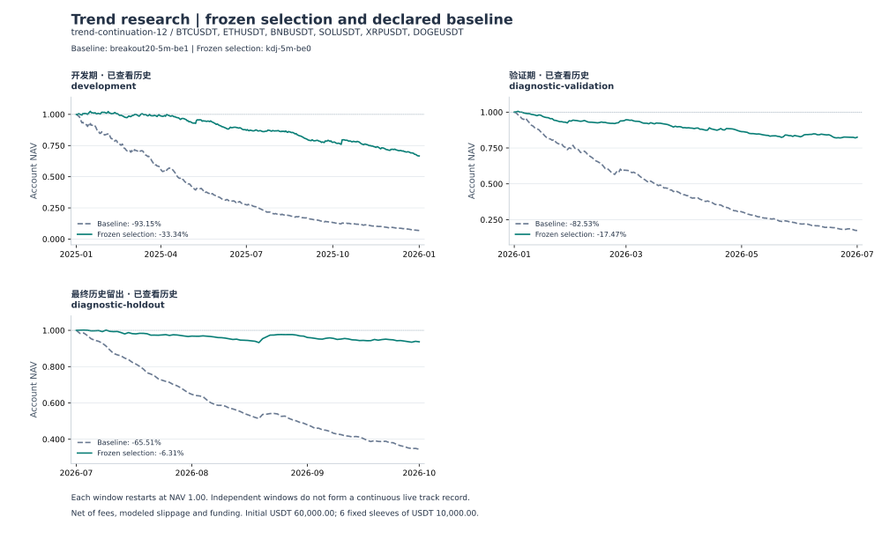

# KDJ 回调入场与分阶段退出：本轮研究结论

本轮没有通过预先声明的接受条件。三种 5 分钟 KDJ 保本规则在开发期均亏损、六个品种均无盈利；按冻结规则选出的 `kdj-5m-be0` 后续净收益仍为 **−17.47% 和 −6.31%**，双倍手续费与滑点下为 **−34.29% 和 −18.23%**。保留这个失败结果，不从后续区间重新选参数。

这是对截图思路所作的一组明确、可执行假设的检验，不代表截图原作者的完整策略。研究使用 Binance USDT 永续历史数据，不是原油市场验证。全部区间在此前研究中已经查看过；“最终历史留出”只表示本次固定的最后一个分段，不是未触碰样本外、前瞻或实盘证据。

完整数字、逐币 Rust 评价与收据见 [REPORT.md](REPORT.md) 和 [results.json](results.json)；事前规则见 [kdj-plan.json](../kdj-plan.json)。

## 固定规则与比较边界

- KDJ 为 9、3、3，初始 K/D 为 50；RSV 包含当前完整 K，未满 9 根不更新，平窗口 RSV 为 50，J 只展示。慢均线为同周期 EMA60，价格和三根前的 EMA 斜率共同确认方向，至少 63 根完整 K。
- 顺慢均线方向，K≤20 武装做多、K≥80 武装做空；必须在之后另一根完整 K 才能由 K/D 交叉触发一次。方向失效、已有持仓或风控禁止清除资格，必须先离开极值区再返回。不是每个金叉或死叉都交易。
- 双向交易，初始止损 2 ATR；完整交易 K 收盘达到初始风险的 0/1/2R 时决定保本，其中 0 关闭保本。跟踪固定从 2R 启动，距离为最新完整 K 的 3 ATR，使用入场以来极值并只收紧。R 固定为实际入场价与初始止损之间的距离。
- BE0/BE1/BE2 比较只改变保本规则。`kdj-5m-be1` 与 `breakout20-5m-be1` 比较只改变入场规则。冻结选择 BE0 与突破 BE1 同时改变了入场和保本，不能把二者差异全部归因于 KDJ。
- 六币各 10,000 USDT，总额 60,000；每笔风险预算 0.5%，名义敞口上限 95%，同一冷却和日亏损风控。基础单边手续费 5 bps、滑点 2 bps，扣历史资金费。窗口独立重置资金，不拼接为一条持续实盘曲线。

## 保本规则：BE0 被选中，但没有合格候选

只允许三个 5 分钟 KDJ 候选参与开发期选择；各币至少 10 笔且日 Sharpe 可定义后，按账户日 Sharpe 排序。是否达到“至少四币盈利且逐币平均净 R 的中位数为正”另行判定。BE0 的开发期 Sharpe 为 −3.820，略高于 BE2 的 −3.832，高于 BE1 的 −5.127，因此冻结选择 BE0，同时明确记录 `developmentQualified=false`。

| 保本规则 | 2025 净收益 | 2026 H1 净收益 | 2026 Q3 净收益 |
|---|---:|---:|---:|
| kdj-5m-be0 | -33.34% | -17.47% | -6.31% |
| kdj-5m-be1 | -37.77% | -20.62% | -9.06% |
| kdj-5m-be2 | -33.40% | -17.46% | -6.30% |

BE1 在三个窗口均比 BE0 更差，BE2 与 BE0 接近。这支持本轮固定规则下“提前保本没有改善结果”的描述，不能推广成所有趋势策略都不应保本。提前退出也会改变后续可开仓机会，因此这是整套交易规则的对照，不是对同一批匹配交易简单替换一个退出价。

| 窗口 | 规则 | 完成交易 | 净 PF | 净单笔期望 USDT | 日终最大回撤 |
|---|---|---:|---:|---:|---:|
| 2025 开发 | kdj-5m-be0 | 3,011 | 0.768 | -6.64 | -34.94% |
| 2025 开发 | kdj-5m-be1 | 3,111 | 0.670 | -7.28 | -38.26% |
| 2026 H1 验证 | kdj-5m-be0 | 1,417 | 0.737 | -7.40 | -18.45% |
| 2026 H1 验证 | kdj-5m-be1 | 1,462 | 0.625 | -8.46 | -20.94% |
| 2026 Q3 历史留出 | kdj-5m-be0 | 747 | 0.813 | -5.07 | -6.91% |
| 2026 Q3 历史留出 | kdj-5m-be1 | 782 | 0.669 | -6.95 | -9.38% |

净 PF 是净盈利交易总额除以净亏损交易总额的绝对值，已包含交易成本；净单笔期望是完成交易净盈亏的算术平均。单笔金额受动态仓位和账户缩水影响，不应单凭金额跨策略比较信号质量。表中回撤按六个账户合计的日终权益计算，区别于逐币的分钟与成交回撤。

## 同周期入场对照：交易显著减少，但没有获得正净期望

这里固定 EMA60、5 分钟周期、BE1、2R 启动的 3 ATR 跟踪、风险预算与费用，仅比较 KDJ 回调入场和前 20 根通道突破。

| 窗口 | KDJ / 突破笔数 | 笔数减少 | KDJ / 突破净收益 | KDJ / 突破日终最大回撤 |
|---|---:|---:|---:|---:|
| 2025 开发 | 3,111 / 17,529 | 82.3% | -37.77% / -93.15% | -38.26% / -93.15% |
| 2026 H1 验证 | 1,462 / 8,561 | 82.9% | -20.62% / -82.53% | -20.94% / -82.53% |
| 2026 Q3 历史留出 | 782 / 4,579 | 82.9% | -9.06% / -65.51% | -9.38% / -65.51% |

KDJ 降低了约 82%–83% 的交易次数并显著减少损失，但其净 PF 仍为 0.670、0.625、0.669，均低于 1。收益好于这个高换手的亏损基线，不等于策略已经盈利。按同一天合计账户收益做 7 日循环块、2,000 次配对重采样，KDJ BE1 减突破 BE1 的日均收益差 95% 区间依次为 [48.33, 69.96]、[68.93, 96.17]、[87.77, 119.09] bps；这只描述本批历史中的相对差异，未校正此前研究复用。通用报告中的配对表是冻结选择 BE0 对基线，二者比较含两个规则变化。

## 失败归因：成本超过这条成交路径可提供的毛盈亏

下表金额均为 USDT。成本前盈亏减手续费、滑点及取整、资金费净支出等于净盈亏；资金费负数表示收入。这些成本已经包含在净值和净 PF 中，不能再次扣除。

| 窗口 | 规则 | 成本前盈亏 | 手续费 | 滑点及取整 | 资金费净支出 | 总成本 | 净盈亏 |
|---|---|---:|---:|---:|---:|---:|---:|
| 2025 开发 | kdj-5m-be0 | 7,240.27 | 19,114.40 | 8,018.35 | 113.75 | 27,246.49 | -20,006.22 |
| 2025 开发 | kdj-5m-be1 | 4,436.17 | 19,040.77 | 7,975.49 | 81.61 | 27,097.86 | -22,661.70 |
| 2026 H1 验证 | kdj-5m-be0 | 4,329.50 | 10,352.46 | 4,385.80 | 72.74 | 14,811.01 | -10,481.51 |
| 2026 H1 验证 | kdj-5m-be1 | 2,781.74 | 10,603.95 | 4,495.00 | 57.18 | 15,156.13 | -12,374.39 |
| 2026 Q3 历史留出 | kdj-5m-be0 | 5,194.82 | 6,225.53 | 2,735.15 | 22.90 | 8,983.58 | -3,788.76 |
| 2026 Q3 历史留出 | kdj-5m-be1 | 3,712.92 | 6,341.40 | 2,790.76 | 15.43 | 9,147.58 | -5,434.66 |

BE0 的成本前盈亏三个窗口都为正，但总成本分别达到它的 3.76、3.42、1.73 倍；BE1 分别为 6.11、5.45、2.46 倍。手续费和模拟滑点占绝大部分，资金费不是主要亏损来源。当前成交路径的毛盈亏不足以支付设定的执行成本，不能只凭金叉形态或较少交易宣称有可交易优势。

**成本前值是当前成交账本的归因，不是重新运行的零费用策略。** 手续费与滑点改变实际入场、数量、保本位置、风控和后续交易路径；不能把成本加回净收益就当成零成本回测，也不能据此推断降低费率后必然盈利。独立双倍成本回放才包含这些路径变化。

突破基线的成本前盈亏为 +7,571、−3,697、−4,442 USDT，对应总成本 63,462、45,823、34,864 USDT；后两个窗口连这条成交路径的成本前盈亏也为负。15 分钟 KDJ 的开发期成本前盈亏同样为负（−2,565 USDT）。因此整组候选的问题不能概括为“全部只是费用太高”。

## 预先声明的压力与参照

| 后续窗口 | BE0 基础成本 | BE0 双倍费用/滑点 | BE0 止损 1.5 ATR | BE0 止损 2.5 ATR |
|---|---:|---:|---:|---:|
| 2026 H1 验证 | -17.47% | -34.29% | -22.60% | -13.00% |
| 2026 Q3 历史留出 | -6.31% | -18.23% | -9.62% | -4.42% |

提高止损倍数的有限敏感性对照降低了亏损，但两个窗口仍为负；它不是新的被选策略，也不触发继续搜参。双倍成本下 BE0 的净 PF 为 0.487、0.518，净单笔期望为 −14.45、−14.59 USDT，预先声明的成本稳健性条件失败。

固定的 15 分钟 KDJ BE1 三个窗口收益为 −16.35%、−0.70%、−1.64%，交易数为 1,073、463、244；损失较小仍不足以通过正收益条件。它改变了采样频率和持仓路径，未加入选择池。当前 4 小时背景过滤、仅做多、通道退出参照为 +1.09%、−1.67%、+0.62%，仅有 33、23、14 笔；周期、方向和管理均不同，不能把差异归因于某一个指标，也不能据其小样本正收益作收益承诺。



图中 BE0 对突破 BE1 展示的是冻结选择与预定基线，包含入场和保本两项变化；纯入场对照应看上面的 BE1 对 BE1 表。每个面板重新投入 60,000 USDT，不连续复利拼接。

## 市场差异与复核边界

Binance USDT 永续使用连续交易的分钟成交价、标记价和资金费资料。本轮没有验证原油的具体交易所与合约、合约乘数和最小价位、交易时段与休市、到期换月、保证金与强平、跳空及真实止损成交。分钟 OHLC 也不能恢复同一分钟内高低点顺序、排队与部分成交。因此结果不能直接外推为原油策略有效或无效，更不能替代原油数据和执行规则的独立验证。

本轮六个存续高流动性币不是时点完整交易池，也不是六个独立资产类别。所有历史已经看过；冻结这次参数与最后分段可以限制本轮事后调整，不能消除以往研究带来的选择偏差。

执行器 `trend-continuation-12`，共享评价 `trend-account-evaluation-2`。官方档案经过下载阶段的校验，清单绑定计划；发布前账本审计通过 18 个品种/窗口批次，核对配置、二进制、收据、完整 UTC 日历和现金账本。该次发布审计不再次逐一重算来源 CSV 哈希。

- 计划 SHA-256：`4ee928922f190142814bbc863898a20ed6a3ca2db56b01f245ee3160d806513c`。
- 清单 SHA-256：`611a5a22743936dcf2a9d1ff90d18663c5900fb4802a5cde7ddad8ea5c696ede`。
- 二进制 SHA-256：`c4d446650027df4d6f05e14a84382d7032fbf886180de77d3dc4a6195671554f`。
- 原始运行：`tmp/trend-kdj-v6`；收据保留于该目录。新发布文件与原运行路径登记在 `scripts/trend/frozen.json`，不改写旧研究。

只读复核命令：

```sh
python3 scripts/trend/audit.py --frozen
python3 scripts/trend/audit.py --plan research/trend/kdj-plan.json --manifest tmp/trend-kdj-v6/manifest.json --input tmp/trend-kdj-v6
```
