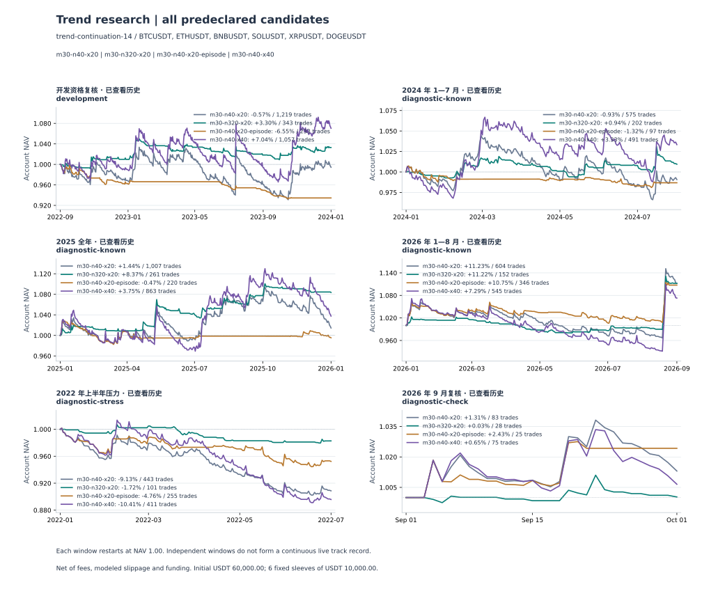

# 30 分钟趋势策略的文献启发实验

四组固定对照已完成。**延长入场观察窗口在部分历史区间改善了净收益、成本负担和回撤，但没有任何方案达到事前接受门槛，也没有据此确认未来正期望。** 每突破片段只接受首次信号未稳定增值；单独放慢退出有阶段性收益改善，也承担了更深的部分回撤。界面默认策略保持原经济规则。

这次是论文启发的三个新机制对照，使用已经查看过的六段历史。不存在新的未触碰样本外区间；2026 年 9 月的目录名 fresh-september 只是旧标识。所有组均公开，参数没有因结果改变。

## 固定假设与执行口径

| 对照 | 入场观察 | 通道退出 | 重入规则 | 相对基准唯一改变的显式策略字段 |
|---|---|---|---|---|
| 基准 | 40 根，即 20 小时 | 前 20 根低点 | 每个新完成收盘可重新发信号 | 无 |
| 长入场 | 320 根，即 160 小时 | 前 20 根低点 | 同基准 | breakoutBars |
| 每片段仅首次 | 40 根 | 前 20 根低点 | 首次突破后冻结边界，回到边界内才解锁 | breakoutReentry |
| 慢退出 | 40 根 | 前 40 根低点 | 同基准 | channelExitBars |

全部只做多，信号使用 UTC 完整 30 分钟 K 线，当前信号 K 不计入此前高低点；收盘超过前 N 根最高价至少一 tick，次分钟开盘计入不利滑点和取整成交。ATR14 使用 Wilder 平滑，初始硬止损距成交价 2 ATR，风险单位在入场冻结。通道退出在收盘严格低于此前指定根数最低价后，于次分钟开盘执行；已有硬止损先监控。没有启用保本、ATR 跟踪、固定盈利目标、趋势过滤、成本过滤或定时平仓。

每突破片段仅首次的定义独立于账户可用性：持仓、冷却、过滤和订单拒绝仍消耗首次原始突破；平仓不能清除冻结边界。后续收盘回到冻结边界或内侧才解锁，解锁当根不再生成新片段。预热只建立历史与指标，研究开始时片段状态为空。

长入场配置按活跃窗口自动读取 7 日预热，其他三组为 1 日。因此虽然仅改变一个显式策略字段，研究起点的 Wilder ATR 初始化状态也可能不同，差异随递推衰减。本轮完整保留该预先声明规则，不能宣称所有收益差都严格来自边界长度。30 分钟 ATR 和 20 根退出均保持；它不是旧 4 小时策略的复制。

BTC、ETH、BNB、SOL、XRP、DOGE 六个独立子账户，各 10000 USDT，总计 60000 USDT。每笔风险 0.5%，名义敞口上限 95%，连续三次亏损冷却 60 分钟，日亏损门槛 3%；允许跨日。正常成本每边手续费 5 bps、滑点 2 bps，另计真实历史资金费。五个非开发窗中，所有四组都以手续费 10 bps、滑点 4 bps 完整重放，资金费不倍增。开发窗未预定压力回放。

## 全部净收益与成本压力

每格为正常成本／双倍费滑净收益，已经包含资金费。各窗口独立重置资金，不能连乘为一条实盘收益曲线。

| 窗口 | 基准 40／20 | 长入场 320／20 | 每片段仅首次 40／20 | 慢退出 40／40 |
|---|---:|---:|---:|---:|
| 开发期 2022-09 至 2023-12 | -0.57%／未测 | +3.30%／未测 | -6.55%／未测 | +7.04%／未测 |
| 2024 年 1—7 月 | -0.93%／-5.25% | +0.94%／-0.60% | -1.32%／-1.93% | +3.33%／-0.69% |
| 2025 全年 | +1.44%／-6.33% | +8.37%／+5.30% | -0.47%／-1.83% | +3.75%／-2.96% |
| 2026 年 1—8 月 | +11.23%／+2.77% | +11.22%／+8.31% | +10.75%／+5.57% | +7.29%／+0.34% |
| 2022 年上半年 | -9.13%／-11.12% | -1.72%／-2.14% | -4.76%／-6.12% | -10.41%／-11.94% |
| 2026 年 9 月 | +1.31%／+0.18% | +0.03%／-0.20% | +2.43%／+1.67% | +0.65%／-0.39% |

长入场的 2025 年收益由基准 +1.44% 改善为 +8.37%，压力收益由 −6.33% 改善为 +5.30%；2026 年正常收益几乎相同，但压力收益由 +2.77% 改善为 +8.31%。不过其 2022 熊市仍亏损，2024 年及 2026 年 9 月压力后也为负，未通过跨窗口接受门槛。不能只取 2025、2026 年前八个月宣布成功。

## 长入场改善了什么

下表使用 2025 年同资金、同费用、同初始风险预算的完整账户。成本前盈亏是实际账本加回所列成本的归因，不是重新执行的零成本策略。

| 指标 | 基准 40／20 | 长入场 320／20 |
|---|---:|---:|
| 完成交易 | 1007 | 261 |
| 净胜率 | 26.81% | 32.57% |
| 平均盈利 USDT | 124.24 | 152.90 |
| 平均亏损 USDT | -44.34 | -45.32 |
| 净 PF | 1.026 | 1.629 |
| 平均成本前 R | 0.1596 | 0.5563 |
| 平均成本 R | 0.1430 | 0.1349 |
| 平均净 R | 0.0167 | 0.4214 |
| 成本前盈亏 USDT | 7,061.52 | 6,615.37 |
| 总成本 USDT | 6,197.48 | 1,596.03 |
| 净盈亏 USDT | 864.04 | 5,019.33 |
| 持仓中位小时 | 11.00 | 12.00 |
| 平均子账户持仓时间占比 | 30.17% | 9.02% |
| 日收益 Sharpe | 0.196 | 1.555 |
| 日终最大回撤 | -7.28% | -3.36% |

长入场减少 74.1% 的交易和 74.2% 的总成本，账本成本前盈亏仍为基准的 93.7%。单笔成本 R 仅由 0.1430 降至 0.1349，主要变化是减少交易次数并改变交易机会集合。它没有通过降低手续费假设获得优势。不同交易集及仓位路径下，这些金额差不是同一组交易的因果过滤效果。

回撤改善也伴随更低的市场暴露：2025 年平均子账户持仓时间占比由 30.17% 降到 9.02%。这是时间占比，不是名义敞口、beta 或组合波动率；同风险预算不意味着同实际风险。没有把长入场加杠杆拉回相同波动率。

2025 年长入场五币盈利，BTC 亏损；2026 年前八个月五币盈利，BNB 亏损。开发期只有 BTC、ETH、SOL 三币盈利，仍未达至少四币盈利的资格。2026 年前八个月，最盈利约 5% 的完成交易贡献正净利润总额的 74.6%，趋势收益明显集中；这是收益形状描述，不能删除赢家后就宣布策略无效。

## 为什么另外两项没有形成稳定改进

**每突破片段只接受首次信号过于严格。** 2025 年交易从 1007 降至 220，总成本从 6197.48 降至 1090.94 USDT，但成本前盈亏也从 7061.52 降至 810.17 USDT，最终净亏 280.77 USDT。开发期六币全亏，ETH／XRP 甚至不足每币 30 笔。2026 年与 9 月有较好结果，却不能抵消其他窗口的失败。降低换手需要保留可交易的趋势延续，不能把首个突破之外的全部机会都视为噪声。

**慢退出增加了部分盈利单的收益，也放大了部分回撤。** 2025 年平均盈利从 124.24 增至 175.68 USDT，净胜率从 26.81% 降至 22.60%，净收益 +3.75%，但压力后 −2.96%；2026 年净收益降至 +7.29%，日终最大回撤由 −8.96% 扩大到 −13.08%，压力时 −16.08%。完整账户退出变化会影响后续入场，本轮没有进行同一入场样本的配对退出反事实，不能仅凭平均盈利变化认定直接退出因果。

## 不确定性与事前门槛

每日先汇总六个子账户权益，再使用七日循环块重采样 2000 次，保留同一天共同市场冲击。以下是正常成本“长入场减基准”的日均收益差，单位 bps／日。

| 窗口 | 日均差 | 95% 配对区间 | 长入场自身日均收益 95% 区间 |
|---|---:|---|---|
| 开发期 2022-09 至 2023-12 | +0.616 | [-3.525, 4.411] | [-0.994, 2.828] |
| 2024 年 1—7 月 | +0.812 | [-3.474, 4.829] | [-2.272, 3.614] |
| 2025 全年 | +1.720 | [-1.886, 5.023] | [-0.377, 5.289] |
| 2026 年 1—8 月 | -0.194 | [-5.956, 5.122] | [-2.027, 15.129] |
| 2022 年上半年 | +4.259 | [-0.322, 8.296] | [-2.561, 0.671] |
| 2026 年 9 月 | -4.421 | [-20.508, 11.207] | [-4.923, 5.613] |

长入场六个窗口自身区间及相对基准区间全部跨零。三项机制共 18 个正常成本配对区间，仅 episode 在 2022 熊市的相对改善区间略高于零，约 [0.064, 5.255] bps／日；该账户仍亏损，区间也没有校正整个项目的多次尝试，不能作为绝对正期望证据。所有机制、逐币和压力结果见 [REPORT.md](REPORT.md) 与 [results.json](results.json)。

事前门槛要求开发资格通过，并在五个诊断窗的正常与压力成本下都为正；所有四组均失败。长入场、慢退出及基准在开发期均仅三币盈利；episode 为样本不足且六币全亏。机器可复核资格记录见 [qualification.json](qualification.json)。不按本轮最佳收益更换基准、不追加参数搜索、不将默认规则换成长入场。

## 实现与审计

配置 v8 将通道退出窗口与入场窗口解耦，突破片段状态属于信号层，账户撮合和风控继续共用 Rust 引擎。旧 v4—v7 不接受新字段，缺省行为保留；历史记录、导出与图表可读取独立退出窗口，当前默认策略仅升级配置结构。Python 负责冻结协议、评价和独立核验，没有另建资金撮合器。

回放覆盖 36 个品种窗口批次、264 个候选成本结果行、16451 笔完成交易。交易计数包含不同方案和成本情景的重复路径，不是独立样本数。账本成本与日历已通过通用审计。独立核验重新校验 642 个源文件，检查所有成交的信号边界、ATR、次开盘价格、数量、费用、资金费与现金；2125 笔 episode 成交均满足首次片段资格。66 行正常／压力旧基准的完整交易、日权益及指标严格相同。它没有独立重演所有日内风控触发及未成交拒绝，CLI 也未输出 setup 事件，因此不宣称审计全部禁入路径；这些边界另由 Rust 定向测试覆盖。完整核验见 [execution-audit.json](execution-audit.json)。

验证通过：67 项 Python 测试、143 项 TypeScript 测试、Rust 全量及新增分片回归、TypeScript 全项目类型检查及仓库 check（0 errors，35 项 lint 警告）；WASM 已重新构建，通道／KDJ／价格行为三个离线档案浏览器 smoke 均通过（分别 146／17／9 笔）。这些是实现验证，不能代替策略样本外有效性。

复现入口见 [Binance 趋势研究文档](../../../docs/BINANCE-TREND.md#文献启发的-30-分钟机制实验)。[计划](../literature-plan.json)、输入清单、二进制、原始结果和报告均有身份校验；原始运行位于 tmp/trend-literature-v8，旧 47 项冻结证据未改写。

## 研究边界

- 六个存续币种及静态精度假设，不能代表当时完整可投资标的集合；资金在独立子账户间不调拨。
- 分钟 OHLC 成交不包含真实盘口、冲击、排队及清算机制；费用压力不能替代实盘执行验证。
- 2022 年 7—8 月、2024 年 8—12 月沿用旧研究遗漏范围，不能解释为这些月份全部没有行情；没有按本轮盈亏另选日期。
- 账户图表与组合回撤使用日终权益，逐币引擎另有分钟估值回撤，不能混为同一采样指标。
- 本轮检验三个主要机制；成交量过滤、多尺度组合、固定 2R 止盈没有加入候选，不能从本轮推断其表现。
- 文献提供可证伪假设，不提供这些参数的盈利保证。仅长入场展现值得解释的历史改善，仍未达到预定保留门槛。

相关原始方法来源：[趋势信号构造](https://www.aqr.com/Insights/Research/Journal-Article/Which-Trend-Is-Your-Friend)、[加密技术策略与成本](https://www.sciencedirect.com/science/article/pii/S1042443122000816)、[比例成本下的交易区域](https://arxiv.org/abs/1203.5957)、[停损规则的过程依赖](https://dspace.mit.edu/entities/publication/bb69ca4b-0cdc-487f-831d-63b2e84fafee)。这些论文未检验本轮四个具体 Binance 永续规则。
