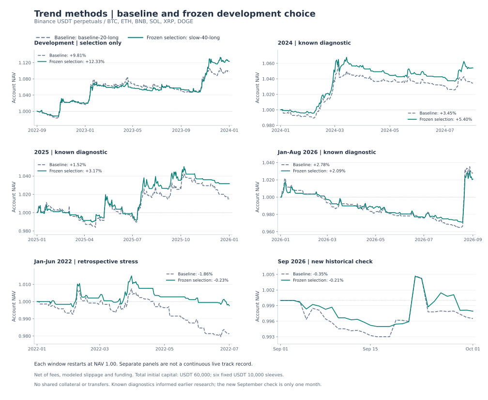

# 趋势策略修复后的方法比较

研究日期：2026-10-03。使用 Binance 官方分钟成交价、标记价与真实资金费。

冻结选择达到了预先声明的历史改善条件，值得继续前向模拟。 开发期选中 `slow-40-long`，基线为 `baseline-20-long`。2026 年 9 月仅有 30 个日收益样本，不能据此确认长期正期望。



## 固定方法与资金口径

在运行本轮结果前固定十个候选：4 小时 20／40／80 根通道分别只做多或双向；另在 20 根只做多基线上分别增加同周期 EMA、背景、独立成本门槛，或改成 ATR 保本跟踪退出。后三个过滤实验保持初始止损与退出一致；ATR 对照是整套退出政策的比较。

所有账户总初始资金 60,000 USDT，六个币各 10,000 USDT，按实际数量步长和最小订单回放，再合计账户净值。固定分仓，无共享保证金、动态调拨或跨币净额撮合。每笔风险为所属子账户权益的 0.5%，初始约 50 USDT，即总初始资金的 0.0833%；95% 名义敞口与 3% 日损限制也分别作用于各子账户。初始止损 2 ATR，通道退出窗口为入场窗口的一半。手续费与滑点单边为 5／2 bps，压力情形为 10／4 bps，均扣真实资金费。

每段独立开始资金和持仓，不拼接实盘净值。开发期按账户日收益 Sharpe 选择，要求每币至少十笔交易；其余区间只能否定或诊断，不能改选。固定种子、2,000 次七日循环块重采样；置信区间未校正本次十候选选择，不将其称为 DSR。

2024 至 2026 年 8 月已被之前研究查看，全部明确标为诊断。2022 年上半年是额外历史压力区间，因已知 7 月数据缺口而在 6 月末结束，并非前向检验。9 月档案可用性在计划冻结前确认，9 月收益仅在开发期选择冻结后计算，未用于选参。

## 全部预先声明候选

| 规则 | 开发期收益 | 2024诊断 | 2025诊断 | 2026诊断 | 2022压力 | 9月新增检验 |
|---|---:|---:|---:|---:|---:|---:|
| baseline-20-long | 9.81% | 3.45% | 1.52% | 2.78% | -1.86% | -0.35% |
| slow-40-long | 12.33% | 5.40% | 3.17% | 2.09% | -0.23% | -0.21% |
| slow-80-long | 7.96% | 3.84% | 1.27% | -0.36% | -0.28% | -0.35% |
| channel-20-both | 8.90% | 3.42% | 0.01% | 4.21% | 1.95% | -1.12% |
| channel-40-both | 11.68% | 4.54% | 0.75% | 4.28% | 2.23% | -0.95% |
| channel-80-both | 5.93% | 2.95% | -1.88% | 3.28% | 2.95% | -0.43% |
| ema-20-long | 7.07% | 4.16% | 2.94% | 1.92% | -0.10% | -0.29% |
| background-20-long | 2.98% | 1.03% | 1.09% | -0.93% | -0.13% | -0.22% |
| cost-20-long | 9.81% | 3.45% | 1.52% | 2.78% | -1.86% | -0.35% |
| atr-20-long | 1.54% | 0.89% | 1.39% | -0.07% | -1.11% | -0.14% |

## 冻结选择与基线

| 区间 | 基线收益 | 选择收益 | 基线Sharpe | 选择Sharpe | 基线日回撤 | 选择日回撤 | 选择双倍成本收益 |
|---|---:|---:|---:|---:|---:|---:|---:|
| 开发期 2022年9月至2023年末 | 9.81% | 12.33% | 1.448 | 1.785 | -3.64% | -2.27% | — |
| 已查看 2024年1至7月 | 3.45% | 5.40% | 1.163 | 1.852 | -3.70% | -2.89% | 4.80% |
| 已查看 2025年 | 1.52% | 3.17% | 0.388 | 0.812 | -2.96% | -2.69% | 2.67% |
| 已查看 2026年1至8月 | 2.78% | 2.09% | 0.726 | 0.644 | -5.55% | -4.55% | 1.65% |
| 额外历史压力 2022年上半年 | -1.86% | -0.23% | -1.450 | -0.192 | -2.76% | -1.70% | -0.35% |
| 新增历史检验 2026年9月 | -0.35% | -0.21% | -0.953 | -0.608 | -0.82% | -0.67% | -0.24% |

新增 9 月检验：冻结选择完成 12 笔交易，盈利币种 2/6。相对基线的日均收益差 95% 配对块 bootstrap 区间为 [-2.091, 2.999] bps。配对在同一天六币合计账户收益上进行，保留共同市场冲击，不把每币或每笔交易当独立样本。

三个已查看诊断区间合计，基线 466 笔、冻结选择 253 笔；手续费分别为 697.37 与 389.29 USDT。各段独立起始，以上仅加总交易和费用，不表示连续实盘净值。这支持其减少换手的特征，不能将全部收益变化归因于手续费。

历史改善条件：`positiveKnownReturns`=通过；`positiveKnownStress`=通过；`higherSharpeInTwoKnownWindows`=通过；`noWorseDrawdownInTwoKnownWindows`=通过。开发期资格独立记录为通过，不改变冻结计划的历史改善口径。

所有未选中候选和邻近止损结果均完整保存，不能用 9 月表现最好的规则替换开发期选择。窗口变化同时改变持仓长度和退出窗口，不能把差异全部解释为单一入场优势。每种配置按自身指标窗口预热，递归 ATR 的初期种子也可能随预热长度变化，因此过滤对照也不构成完全隔离的因果估计。

## 修复与可复现性

配置升级为 v5，成本门槛与背景过滤独立；新建研究采用已有 4 小时简洁通道候选，旧草稿保留方向、周期、成本与风控。原生与浏览器使用同一预热算法，批量原生回放对每个配置单独预热；修复恰好一个价格步长突破的浮点边界。执行器为 trend-continuation-6。

本报告重新回放修复后的引擎，与旧报告的引擎、预热和边界不同；旧结果保留，不覆盖。本次原始账本、配置、数据清单及收据在 tmp/trend-methods，结果哈希、每候选预热起点、输入档案来源及选择过程保存在 results.json。

```bash
python3 scripts/trend/download.py --plan research/trend/methods-plan.json --output tmp/trend-methods
cargo build --release --manifest-path crates/quant/Cargo.toml --bin trend
python3 scripts/trend/research.py --plan research/trend/methods-plan.json --manifest tmp/trend-methods/manifest.json --output tmp/trend-methods
python3 scripts/trend/methods_report.py
```

## 证据边界与后续研究

六种存活加密资产存在相关性和选择偏差。固定滑点、分钟 OHLC、资金费分钟标记价近似不代表实盘成交质量；未模拟强平、市场冲击或断线。总资金分仓是可记账的独立子账户组合，不是交易所共享保证金账户。

下一步固定规则做前向模拟，记录实际成交滑点、持仓和资金费。若比较多周期组合，应按实际拆分资本分别回放数量限制，再合并账户；不能把全额资金运行的多条收益曲线当作无成本可交易组合。

[Which Trend Is Your Friend?](https://www.aqr.com/Insights/Research/Journal-Article/Which-Trend-Is-Your-Friend)支持将成本、仓位与分散作为趋势实现的核心决策；[长期趋势研究](https://www.aqr.com/insights/research/journal-article/a-century-of-evidence-on-trend-following-investing)不能直接证明加密货币 4 小时规则有效；[Deflated Sharpe Ratio](https://www.davidhbailey.com/dhbpapers/deflated-sharpe.pdf)解释重复试验与非正态收益带来的选择偏差。
