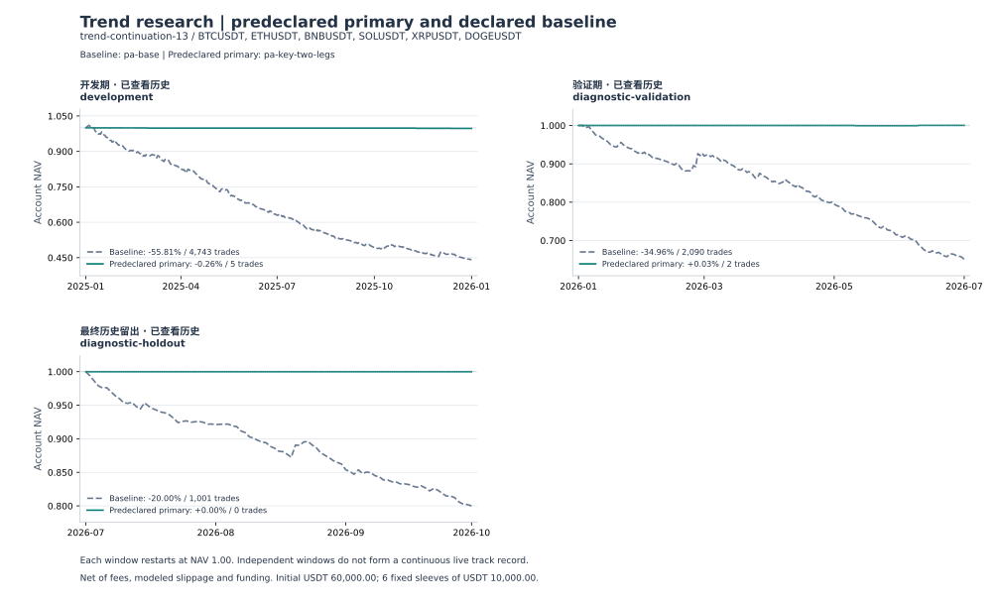

# 价格行为回调：固定机制消融的研究结论

本轮不能确认组合条件具有可交易优势。事前固定主方案 `pa-key-two-legs` 在三个窗口分别只有 **5、2、0 笔交易，总计 7 笔**，开发期资格为 `insufficient-sample`。单独加入关键位或两腿条件后，所有窗口净 PF 仍低于 1；组合条件接近空仓，不能因为亏损小于负收益基线，就判定筛选产生了 alpha。

主方案开发期净亏损 154.09 USDT；2026 H1 的两笔交易净盈利 19.34 USDT，双倍手续费与滑点后转为净亏损 5.45 USDT；2026 Q3 没有交易。**Q3 的零收益、零账户回撤是零交易的结果，不是零风险或稳健性证明。** 预先声明的后两个窗口基础成本与双倍成本均为正的条件没有满足。主方案和候选集均保持不变，没有按结果替换或继续调参。

完整数据与逐币评价见 [REPORT.md](REPORT.md)、[results.json](results.json)；冻结规则见 [price-action-plan.json](../price-action-plan.json)。所有日期在此前研究中都已查看过；“最终历史留出”只是本次固定分段，不是未触碰样本外、前瞻或实盘证据。

## 本次检验的机械子集

- 先在三根完整交易 K 上确认推进：从起点收盘到第三根收盘的方向位移至少 1.5 A0、效率至少 0.6；A0 为起点已完成的 14 TR ATR。资格确认后最多额外延伸八根。第一根逆向收盘 K 开始回调，并把其高低点计入冻结的整段推进极值；不能同根自突破。
- 回调为 2–8 根，包含首根及触发根；含影线回撤深度须为整段推进幅度的 20%–50%。等待收盘越过冻结的整段极值一 tick。第一次越过即消费，即使回撤太浅或其他门槛不满足，也不能继续等待该段的第二次突破。失效后须用新三根推进，不能复用旧窗口。
- 两腿是固定的收盘状态机：逆向收盘开始第一腿；之后另一根收盘越过前根高点一 tick 进入反弹；再之后另一根收盘跌破前根低点一 tick 进入第二腿，空头镜像。一根只能转移一次；它不是“第二根 K 线”，也不是对所有 Brooks H2 变体的实现。
- 关键位为 30 分钟已确认 pivot，左右各两根，左侧严格、右侧允许相等。所选 pivot 必须在推进起点收盘时刻或以前已经确认，且起点收盘位于逆侧或相等。**必须在最初三根资格确认时已穿越关键位一 tick；只在后续延伸阶段才穿越的情形不纳入。** 回调触碰位于 ±0.25 A0 容差内并收在顺侧；逆侧失效条件和触发时顺侧条件按冻结计划执行。这个限制不会因为亏损或样本少而事后放宽。
- 五个候选都使用 5 分钟、双向、同周期慢 EMA60、2 ATR 初始止损、1R 保本、2R 启动的 3 ATR 跟踪。A0 只用于推进资格和关键位容差；初始止损与仓位使用信号 K 最新 ATR，初始 R 冻结。六个币各 10,000 USDT，总额 60,000；单边手续费 5 bps、模拟滑点 2 bps，加历史资金费。
- 这是用户价格行为思路的一种因果、可重复的机械子集，未实现完整的 Brooks 裁量体系、所有 H/L 计数、楔形或其他形态。四种新候选共享识别与消费过程，布尔开关只决定最后的入场条件。

## 全部固定候选与主方案资格

| 候选            | 关键位条件 | 两腿条件   | 角色           |
| --------------- | ---------- | ---------- | -------------- |
| legacy-pullback | 旧入场逻辑 | 旧入场逻辑 | 整体参照       |
| pa-base         | 关闭       | 关闭       | 新检测器基线   |
| pa-key          | 开启       | 关闭       | 关键位消融     |
| pa-two-legs     | 关闭       | 开启       | 两腿消融       |
| pa-key-two-legs | 开启       | 开启       | 事前固定主方案 |

主方案开发期逐币交易数为 BTC 3、ETH 0、BNB 1、SOL 1、XRP 0、DOGE 0，全部未达到每币至少 10 笔的描述性门槛，因此是“样本不足”，不是通过资格的赢家。完整日数充足、Sharpe 可以计算，不代表独立交易样本充足；共享评价的 30 完整日门槛仅决定是否展示年化比率。后续仍按计划完成所有诊断，不替换主方案。

| 窗口             | 候选            | 交易数 |   净收益 | 日终最大回撤 |     净 PF | 净单笔期望 USDT |
| ---------------- | --------------- | -----: | -------: | -----------: | --------: | --------------: |
| 2025 开发        | legacy-pullback |  7,210 |  -70.21% |      -70.45% |    0.6086 |           -5.84 |
| 2025 开发        | pa-base         |  4,743 |  -55.81% |      -56.26% |    0.5968 |           -7.06 |
| 2025 开发        | pa-key          |    338 |   -9.42% |       -9.45% |    0.4217 |          -16.72 |
| 2025 开发        | pa-two-legs     |     90 |   -3.05% |       -3.05% |    0.2906 |          -20.32 |
| 2025 开发        | pa-key-two-legs |      5 | -0.2568% |     -0.2568% | 0.0001007 |          -30.82 |
| 2026 H1 验证     | legacy-pullback |  3,231 |  -48.95% |      -48.95% |    0.5462 |           -9.09 |
| 2026 H1 验证     | pa-base         |  2,090 |  -34.96% |      -34.98% |    0.5571 |          -10.04 |
| 2026 H1 验证     | pa-key          |    135 |   -3.02% |       -3.12% |     0.483 |          -13.41 |
| 2026 H1 验证     | pa-two-legs     |     40 |   -1.29% |       -1.37% |    0.3195 |          -19.32 |
| 2026 H1 验证     | pa-key-two-legs |      2 | +0.0322% |     -0.0402% |     1.802 |            9.67 |
| 2026 Q3 历史留出 | legacy-pullback |  1,623 |  -29.60% |      -29.60% |    0.4748 |          -10.94 |
| 2026 Q3 历史留出 | pa-base         |  1,001 |  -20.00% |      -20.00% |    0.4684 |          -11.99 |
| 2026 Q3 历史留出 | pa-key          |     64 |   -1.48% |       -1.48% |    0.5049 |          -13.87 |
| 2026 Q3 历史留出 | pa-two-legs     |     31 |   -0.52% |       -0.58% |    0.5705 |          -10.11 |
| 2026 Q3 历史留出 | pa-key-two-legs |      0 | +0.0000% |     +0.0000% |    未定义 |          未定义 |

净 PF 为完成交易净盈利总额除以净亏损总额的绝对值，净单笔期望为完成交易净盈亏的算术平均；费用已包含其中。零交易的 PF、单笔期望与 Sharpe 保留为未定义。主方案 2026 H1 的 PF 1.802 只有两笔支持，不能据此推断稳定优势。日终回撤来自合计账户，不能代替逐币分钟与成交回撤。

## 四项事前声明的机制比较

关键位单条件将基线的交易数减少约 93%–94%，两腿单条件减少约 97%–98%；两个条件组合后，交易几乎消失。但关键位单条件的净 PF 为 0.422、0.483、0.505，两腿单条件为 0.291、0.319、0.571，仍全低于 1。减少亏损和减少交易同时发生，尚不能说保留下来的入场更有正期望。

以下为“候选 − 参照”的**账户日均收益差** 95% 配对区间，单位 bps；用固定种子、7 日循环块、2,000 次重采样。全部四组、全部三个窗口均披露。

| 比较                          |      2025 开发 |   2026 H1 验证 | 2026 Q3 历史留出 |
| ----------------------------- | -------------: | -------------: | ---------------: |
| pa-key − pa-base              | [14.48, 24.05] | [13.02, 29.22] |   [14.59, 29.97] |
| pa-two-legs − pa-base         | [16.30, 26.16] | [14.04, 30.21] |   [14.54, 31.88] |
| pa-key-two-legs − pa-key      |   [1.76, 3.51] |   [0.98, 2.48] |    [-0.12, 3.12] |
| pa-key-two-legs − pa-two-legs |   [0.34, 1.19] |   [0.28, 1.18] |    [-0.22, 1.35] |

前两行分别是基线上加入一个条件；后两行是已有一个条件时再加入另一个。主方案对 pa-base 同时改变两个条件，不能归因为单一机制。所有比较均是**完整账户规则的效果**：入场与退出时机改变后，后续持仓、冷却、仓位与风控路径也会不同，不能把它当作对同一批匹配交易的纯入场质量评分。

即使配对区间为正，也可能主要反映避免了亏损基线的大量交易，以及主方案近乎空仓。它不证明新条件存在 alpha。Q3 的主方案对两个单条件方案的区间均跨零，而且主方案本身没有交易；区块重采样不能凭空补出策略的交易样本，也未消除历史复用与多项比较影响。

legacy-pullback 对 pa-base 的变化还包括 ATR 锚定、形态寿命、突破位置、失效和消费等规则，因此只作为整体参照。其亏损更大不能归因于关键位或两腿开关。

## 成本前盈亏与执行成本

金额单位 USDT，每行均满足 **成本前盈亏 − 总成本 = 净盈亏**，仅显示数值舍入可能造成一分钱差异。成本前盈亏是当前成交路径的账本归因，不是重新跑零手续费策略；更改成本会改变仓位、保本与后续路径。总成本已经计入净值，不能重复扣除。

| 窗口             | 候选            | 成本前盈亏 |    总成本 |     净盈亏 |
| ---------------- | --------------- | ---------: | --------: | ---------: |
| 2025 开发        | legacy-pullback |    -227.84 | 41,896.56 | -42,124.40 |
| 2025 开发        | pa-base         |    -945.17 | 32,541.52 | -33,486.69 |
| 2025 开发        | pa-key          |  -2,210.11 |  3,442.09 |  -5,652.19 |
| 2025 开发        | pa-two-legs     |    -901.69 |    927.30 |  -1,828.99 |
| 2025 开发        | pa-key-two-legs |     -98.20 |     55.89 |    -154.09 |
| 2026 H1 验证     | legacy-pullback |  -2,432.45 | 26,938.45 | -29,370.91 |
| 2026 H1 验证     | pa-base         |  -1,663.95 | 19,313.62 | -20,977.57 |
| 2026 H1 验证     | pa-key          |    -302.81 |  1,507.71 |  -1,810.52 |
| 2026 H1 验证     | pa-two-legs     |    -294.12 |    478.83 |    -772.96 |
| 2026 H1 验证     | pa-key-two-legs |      41.84 |     22.50 |      19.34 |
| 2026 Q3 历史留出 | legacy-pullback |  -1,065.15 | 16,694.97 | -17,760.12 |
| 2026 Q3 历史留出 | pa-base         |  -1,091.61 | 10,910.35 | -12,001.96 |
| 2026 Q3 历史留出 | pa-key          |    -111.05 |    776.45 |    -887.50 |
| 2026 Q3 历史留出 | pa-two-legs     |      40.68 |    354.15 |    -313.47 |
| 2026 Q3 历史留出 | pa-key-two-legs |       0.00 |      0.00 |       0.00 |

pa-base 和 pa-key 在三个窗口的成本前盈亏均为负；pa-two-legs 只有 Q3 为正 40.68 USDT，但小于当期成本 354.15 USDT。原始机会质量与执行成本都有限制，不能把整组失败归结为手续费一项。

| 主方案窗口       | 手续费 | 滑点及取整 | 资金费净支出 | 总成本 |
| ---------------- | -----: | ---------: | -----------: | -----: |
| 2025 开发        |  39.14 |      15.81 |         0.94 |  55.89 |
| 2026 H1 验证     |  15.86 |       6.64 |         0.00 |  22.50 |
| 2026 Q3 历史留出 |   0.00 |       0.00 |         0.00 |   0.00 |

资金费负数表示收入。滑点与取整已在成交价里体现。主方案开发期成本前已经亏损；H1 的微小正净收益没有通过双倍成本检验。

## 预先声明的完整成本压力回放

压力场景只把手续费从 5 提至 10 bps、滑点从 2 提至 4 bps，资金费仍使用历史值。它重新运行整条交易路径，不是直接从基础收益减一个估计值。没有新增参数组合或止损敏感性。

| 窗口             | 规则            | 基础 / 压力交易数 |     基础 / 压力净收益 | 压力净 PF | 压力净单笔期望 USDT |
| ---------------- | --------------- | ----------------: | --------------------: | --------: | ------------------: |
| 2026 H1 验证     | pa-key-two-legs |             2 / 2 |   +0.0322% / -0.0091% |    0.8459 |               -2.73 |
| 2026 H1 验证     | pa-base         |     2,090 / 2,111 | -34.9626% / -52.5157% |    0.3279 |              -14.93 |
| 2026 Q3 历史留出 | pa-key-two-legs |             0 / 0 |   +0.0000% / +0.0000% |    未定义 |              未定义 |
| 2026 Q3 历史留出 | pa-base         |     1,001 / 1,025 | -20.0033% / -33.6984% |    0.1924 |              -19.73 |



图例显示交易数。各窗口分别以 60,000 USDT 开始，不拼接为连续复利或实盘曲线；主方案 Q3 横线对应零交易。

## 证据边界与复核

本轮结论限定为：这组固定条件下，单条件候选仍亏损，组合主方案交易过少，未建立可交易优势。结果不外推为所有关键位、两腿回调或完整 Brooks 方法有效或无效。该规则要求关键位在最初三根推进内已穿越，不涵盖延伸后才穿越的情形；本轮不因失败而修改这个范围。

六个存续 USDT 永续币不是时点完整交易池或六个独立资产类别。Binance 连续交易的分钟成交价、标记价和资金费不能直接验证原油的合约乘数、最小价位、交易时段、换月、保证金及真实止损成交；分钟 OHLC 也不提供分钟内完整路径、排队与部分成交。

独立技术核对覆盖 96 个价格行为品种／方案／窗口结果行、11,677 笔完成交易的信号快照，包含消融与压力场景；时序、阈值、关键位、两腿和单次形态消费均符合本次实现契约。这验证实现与计划的一致性，不是盈利证据，也不把重复回放的场景算成主方案样本；主方案基础成本仍只有 7 笔。

工程回归通过 139 项 Rust 检查（138 项库测试、1 项 CLI 测试）、1,208 项 TypeScript 测试和三个浏览器流程（价格行为 9 笔、KDJ 17 笔、默认趋势 146 笔）。旧 v6 的四个策略配置在 BTCUSDT 完整 2025 年数据上，用 v12 与 v13 执行器得到的交易、指标、每日权益及元数据，除执行器版本标识外逐 JSON 精确相等。这些回归核验支持实现与兼容性，不增加本研究的交易样本或盈利证据。

执行器为 `trend-continuation-13`；配置 v7，账户评价 `trend-account-evaluation-2`。下载阶段校验并复用官方档案；报告审计核对 18 个品种/窗口批次的配置、收据、计划、二进制身份、完整 UTC 日历和现金账本，本次发布审计不再次逐一重算来源 CSV 哈希。

- 计划 SHA-256：`2954e3c02fe0199bf07fec10193063a6b2f05dc6f2ca1419d7780739c87ebd8e`。
- 清单 SHA-256：`77250a053a9f41dfafbd2ece6b744ff5aab2625aad887d0a76f2eb4c606d0c9c`。
- 二进制 SHA-256：`5c4f7be9e419c8dcc498ab7ab8fb8830b361d336b5029f0af7872c35ffa2b0bd`。
- 原始运行：`tmp/trend-price-action-v7`；完整报告保存原固定主候选及资格，四项配对存于 `results.json` 的 `declaredComparisons`。

只读复核命令：

```sh
python3 scripts/trend/audit.py --plan research/trend/price-action-plan.json --manifest tmp/trend-price-action-v7/manifest.json --input tmp/trend-price-action-v7
python3 scripts/trend/audit.py --frozen
```
