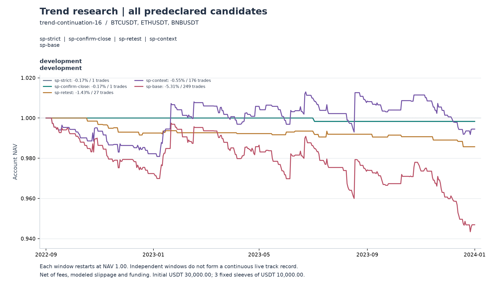

# 30 分钟结构回调：语义优化验证

本轮完成两项规则优化、独立机会观察和真实分钟回放。关键位作为推进背景后，样本与收益都有改善，但预先指定的 `sp-context` 扣费后仍亏损，未通过开发门槛。确认时序的调整没有改变本轮成交。当前结论是值得保留的研究机制，不是已验证的正期望策略。

## 实验边界

在读取本轮结果前冻结 [实验](experiment.json)、[机会观察协议](opportunity-plan.json) 和编译输入；只做两个单因素比较，不搜索参数，不把两个新选项组合，也不根据结果改选主候选。规则仍为 30 分钟收盘突破回调前整段推进极值、下一分钟成交、2ATR 初始止损、3ATR 动态 Chandelier、保本关闭。

BTC、ETH、BNB，2022-09-01 至 2024-01-01（不含结束日），487 天；三个固定 10,000 USDT 子账户。单边手续费 5 bps、滑点 2 bps，另计实际历史资金费和 tick 取整。风险、敞口、冷却、标的与时间分组均沿用首轮。

这是针对首轮失败结果进行的第二次自适应开发，使用已经研究过的数据。新实验登记不消除历史多重尝试，也不构成新的样本外证据。验证域 SOL、XRP、DOGE 本身也是历史复用数据，本轮未解锁；未来 AVAX、ATOM、NEAR 的 2026-10-08 至 2027-10-08 完整留出尚不可用。

## 两项实现与五个固定版本

`confirmation:signal-close` 允许完整突破 K 线确认两根以前的 pivot，再判断形态。它不把信号 K 自身当 pivot，不回填信号，不改变下一分钟成交。旧 `before-breakout` 仍要求确认严格早于信号。

`keyRole:impulse-context` 将关键位用于推进背景：起点已知的 pivot 在推进阶段被突破，或起点位于此前完成两次验证的 EMA 顺侧。资格按原点与推进阶段冻结，不要求本次回调再次触碰；之后逆向失效和信号收盘顺侧约束仍在。它不等于“推进起点必须触及支撑”。旧 `pullback-retest` 保留再次回踩要求。

| 版本 | 关键位用途 | 形态要求 | 确认时点 | 角色 |
|---|---|---|---|---|
| sp-strict | 回调复测 | 至少一种 | 突破前 | 严格旧规则 |
| sp-confirm-close | 回调复测 | 至少一种 | 突破收盘可确认旧拐点 | 仅时序变化 |
| sp-retest | 回调复测 | 关闭 | 突破前 | 关键位对照 |
| sp-context | 推进背景 | 关闭 | 突破前 | 事前指定主候选 |
| sp-base | 关闭 | 关闭 | 突破前 | 简单基线 |

形态关闭的两组用于隔离关键位职责，避免严格形态与复测交集近乎为空。五个版本不代表五次独立证据。

## 账户结果

收益以 30,000 USDT 总初始资金为分母，PF 与单笔 R 均含费用。完整口径见 [账户报告](development/REPORT.md) 和 [交易归因](trade-diagnostics.json)。

| 版本 | 笔数 | 净收益 | 净 PF | 平均净 R |
|---|---:|---:|---:|---:|
| sp-strict | 1 | −0.17% | 0 | −1.133 |
| sp-confirm-close | 1 | −0.17% | 0 | −1.133 |
| sp-retest | 27 | −1.43% | 0.361 | −0.345 |
| **sp-context** | **176** | **−0.55%** | **0.963** | **−0.025** |
| sp-base | 249 | −5.31% | 0.760 | −0.156 |

主候选日终组合最大回撤 −2.09%，日收益 Sharpe −0.117，净胜率 30.68%。这些数值并未建立正期望。

| 主候选分币表现 | 笔数 | 净盈亏 USDT | 平均净 R |
|---|---:|---:|---:|
| BTC | 56 | +675.44 | +0.272 |
| ETH | 52 | −15.16 | +0.011 |
| BNB | 68 | −825.57 | −0.296 |

平均 R 等权计算每笔交易，美元盈亏按实际风险金额加权，因此 ETH 的两个符号可以不同。不能事后删去 BNB 或只保留 BTC 来宣布方案有效。

改善也并非跨币一致：相对回踩组，BNB 净亏损从 168.95 扩大到 825.57 USDT。相对简单基线的总改善 1,428.05 USDT 中，991.75 来自成本前账本改善、436.30 来自成本减少。

`sp-context − sp-retest` 净收益改善 0.88 个百分点，日均收益差 95% 配对区间为 [−1.023, +1.527] bps，仍跨零。相对简单基线改善 4.76 个百分点，区间 [+0.424, +1.606] bps，但这是复用开发数据上的相对比较，未校正多次研究，不替代绝对盈利或样本外验证。

## 共同机会：改善来自哪里

新增观察器复用指标和结构识别，保留 EMA 方向失效、首突破消费和超时规则，但不读取账户持仓、冷却、仓位限制。五个版本都观察到完全一致的 283 次首次突破：BTC 81、ETH 84、BNB 118。总共 1,415 行政策快照，不是 1,415 个独立机会。见 [诊断汇总](opportunity-diagnostics.json) 与 [完整标签](opportunity-diagnostics.events.jsonl.gz)。

| 版本 | 回调资格通过 | 关键位门槛通过 | 形态门槛通过 | 全部门槛通过 |
|---|---:|---:|---:|---:|
| sp-strict | 268 | 27 | 15 | 1 |
| sp-confirm-close | 268 | 27 | 16 | 1 |
| sp-retest | 268 | 27 | 283（关闭） | 27 |
| sp-context | 268 | 202 | 283（关闭） | 190 |
| sp-base | 268 | 283（关闭） | 283（关闭） | 268 |

并行门槛不会因第一个失败条件而停止记录。“关闭项通过”不表示识别到了有效关键位或形态。时序变化只多识别一个形态，其他门槛仍失败，故新增完整机会为零；关键位职责变化在相同机会中增加 163 个通过，移除零个。

283 次首次突破之前共识别 1,683 次推进，其中 1,347 次回调过深失效、23 次方向失效、30 次超时；四类终止计数与推进数对账。没有把未进入突破样本的行情伪装成“突破失败率”。

几何诊断支持首轮发现：226 个快照有 pivot，其中仅 60 个容差带与允许的 20%–50% 回撤带相交；89 个有已验证 EMA，但信号时点的 EMA 容差带全部不相交，记录的实际回踩数为零。EMA 是移动位置，快照只描述当时几何，不能单凭信号时点位置证明所有历史时刻都不可达。

观察机会与账户成交不能直接相减解释原因。实际账户禁用期间会更新可识别推进的起点，同次突破可能得到不同 setup ID。基线中 ETH 和 BNB 各一例在相同信号时点、方向、价格、ATR、边界下有不同推进原点；因此 observer 并非账户 setup ID 的严格超集。主候选本轮 176 笔成交均能匹配 190 个通过机会，但这不是普遍契约。

## 突破准确率与退出诊断

事前固定 6 小时和 24 小时两种完整观察期限，以同样的下一分钟价格入场、2 倍信号 ATR 确定初始 R，分别观察 +1R／+2R 与 −1R 谁先到达。以下依次为“目标先到／止损先到／期限内均未到达”。所有分母包括未到达者；本批没有尾部不足或同分钟双触碰，算法仍保留这两种情况。

| 通过门槛的机会 | 期限 | 样本 | +1R 对 −1R | +2R 对 −1R | 完整期限持有的平均净 R |
|---|---|---:|---|---|---:|
| 回踩关键位 | 6 小时 | 27 | 12／7／8 | 6／9／12 | −0.059 |
| 回踩关键位 | 24 小时 | 27 | 17／10／0 | 8／17／2 | −0.422 |
| 推进背景关键位 | 6 小时 | 190 | 70／65／55 | 34／71／85 | +0.037 |
| 推进背景关键位 | 24 小时 | 190 | 94／93／3 | 57／114／19 | +0.346 |
| 简单基线 | 6 小时 | 268 | 96／94／78 | 42／104／122 | −0.042 |
| 简单基线 | 24 小时 | 268 | 126／139／3 | 74／174／20 | +0.195 |

主候选 24 小时内先到 +1R 的比例为 49.47%，先到 +2R 为 30.00%，不是实际交易胜率。回踩组的 +1R 到达率更高，却仍是亏损账户；单一“准确率”不足以选择策略。

最后一列假设单位持仓维持完整期限，即使途中已经触及屏障也继续观察；它计入成本，但没有账户仓位、止损、后续机会冲突或风险预算。不能据 +0.346R 直接改成 24 小时退出并宣称盈利。同一期限主候选的 MAE 中位数为 1.496R，114／190 个机会在到 +2R 前先到 −1R，原硬止损会先介入。所有期限完整披露，不挑表现更好的期限当新策略。

## 成本与后续研究方向

主候选的实际成交路径：成本前 +972.36 USDT，手续费 783.19、滑点与取整 328.48、资金费净支出 25.98，总成本 1,137.65，最终 −165.29。对应平均成本前 +0.127R、成本 0.152R、净 −0.025R。成本前数值是同一成交路径的归因，不是另跑一个零成本账户。

这比简单基线成本前 −0.003R 有改善，但边际优势不足以覆盖当前成本。不能通过调低费用假设、降低风险或筛掉亏损币把它包装成成功。降低风险可缩小盈亏幅度，不会证明每笔期望转正。

当前证据支持保留“推进背景关键位”作为下一轮待检验入场条件，不支持继续细调 pivot 确认时点，也不支持宣称任何止盈版本已获胜。若继续研究，先单独检验退出机制：动态 ATR 是否因收缩而过早收紧，可用冻结入场 ATR 的跟踪距离作一个预先声明的对照；保留硬止损，重新完整执行账户与成本验证。固定期限诊断只用于形成假设，不用其最佳期限选参数。新一轮仍需记录自适应曝光，主假设失败就停止。

## 执行校验与封存

- [旧版本回放](legacy-parity.json)：新引擎运行 6 个 v9 与 9 个 v8 的 BTC 规则，完整结果行与原冻结结果逐项相等。
- [严格对照复现](strict-control-parity.json)：三标的的 strict／retest／base 共 9 行，仅归一化版本、候选名和新增元数据后，与旧 v9 完整结果精确相等，无浮点容差。
- [执行审计](execution-audit.json)：15 个账户、454 笔成交、2,949 次保护更新、10,519,200 个账户分钟核对通过，重新校验 117 个来源文件哈希。核验完整 K 线 ATR、记录的信号几何、下一分钟成交、初始风险、跟踪时序、资金费、成本及逐分钟权益。
- 审计没有独立穷举全部形态发现、关键位历史选择、EMA 过滤或所有拒绝机会；这些由共享识别器、因果单元测试和机会快照校验覆盖，不能冒充第二套完全独立策略实现。
- 机会标签另用逐分钟标量扫描核对 1,132 条屏障路径（283 个机会 × 两期限 × 两目标），并与全部 60 个汇总目标单元交叉对账，均一致。
- Rust 172 项领域测试和 1 项 CLI 集成测试、Python 201 项测试、TS 154 项定向测试、类型检查及四个浏览器流程通过。新设置、快照、手机展示和导出恢复已验证。

[开发凭证](development-seal.json) 的资格与净收益两项失败；[真实门禁测试](gate-check.json) 确认失败凭证不能编译验证阶段，没有创建验证输出。成本压力、验证域和未来留出均未执行，不能写成“验证失败”或“样本外通过”。

原始回放位于 `tmp/trend-structured-v10`。本轮 native 位于 `tmp/quant-structured-v2-target/release/trend`，SHA-256 为 `2822c162ef4cb3ed65f2b5115c6b585af9817f46cf4404e0678dccd9ea4dc7c4`；旧引擎 14／15 文件未覆盖。配置、账户、观察事件、图表和阶段结论均保留，未启动自动采集或实盘。
