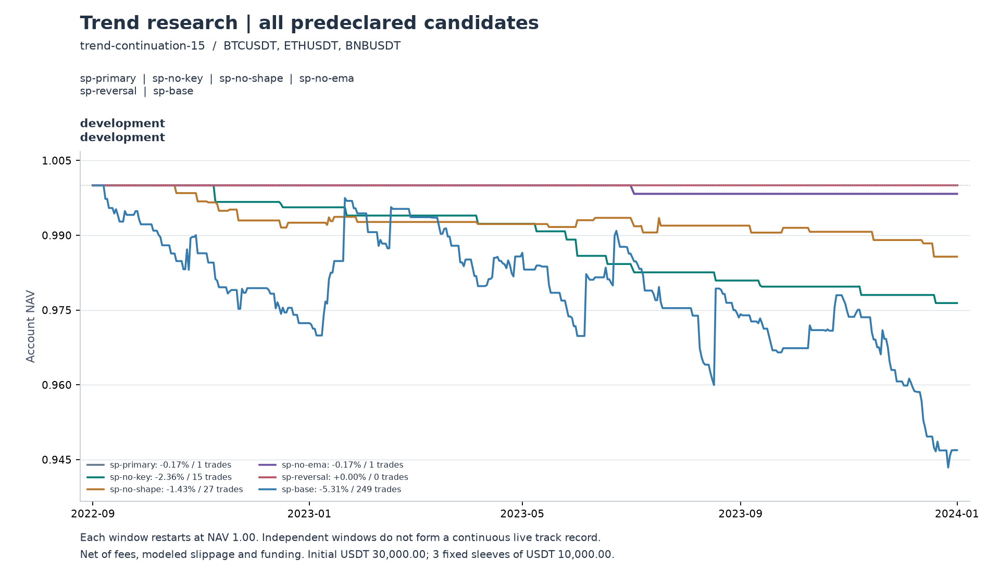

# 结构化回调：实现与首轮开发研究

本轮已实现独立的 30 分钟结构化回调策略、数据目录与标的／时间双轴研究协议，并完成冻结后的开发实验。**固定主方案只产生 1 笔交易，净收益 −0.17%，未达到开发资格，不能认定具有正期望。** 验证阶段被门禁拒绝，未来留出数据尚不存在；本轮没有样本外通过的结论。

这否定的是本轮机械定义进入下一阶段的资格，不能用一笔交易概括整套裁量价格行为方法。没有更换主方案、改变窗口或挑选盈利币种来挽救结果。

## 从主观描述到可执行规则

实现细节、定义来源及局限见 [策略规则](../../../docs/STRUCTURED-PULLBACK.md)。工作台新增“结构化回调研究 · 30 分钟 / 双向”预设；默认通道策略保留。新入口使用配置 v9、引擎 `trend-continuation-15`。

| 原始想法 | 本轮固定定义 |
|---|---|
| 快速、大幅、顺方向推进 | 三根收盘净位移 ≥ 起点已知 ATR 的 1.5 倍，方向效率 ≥ 0.6；主方案辅以 EMA20/60 |
| 大周期关键位 | 2 小时已确认转折的突破回踩，或推进前已两次验证的 EMA20 回踩，二者满足其一 |
| 强势回调 | 2–24 根内回撤 20%–50%，边界冻结为首根逆向收盘前整段推进极值 |
| 两段、楔形、通道、双底／顶 | 使用左右各两根确认的转折点，独立记录各形态标签；主方案要求至少一种 |
| 回调后突破新高／低 | 收盘超过整段推进极值至少一 tick，第一次突破消费该机会；下一分钟开盘模拟成交 |
| 风险与退出 | 实际成交价外 2 倍信号 ATR 初始止损，按 0.5% 子账户风险定仓；每根完整 30 分钟 K 后以持仓极值 ± 3 倍最新 ATR 单调收紧，无保本、无额外启动阈值 |

突破当根不参与此前结构转折的确认；大周期未完成 K、尚未确认转折、入场前持仓极值均不能提前使用。旧止损先检查，新止损此后生效；若新线已到达或越过收盘价，则下一分钟按可执行价格退出。

在当前数学定义中，楔形、通道、双底／顶都是“两段回调”的细分，`shape:any` 与 `shape:two-legs` 的准入集合相同。它们是可重合的解释标签，不是四个独立成功概率。

烛形快照包含吞没、十字星、双十字星、内外包、窄幅和反转；主方案不继续叠加烛形要求，另设一个反转确认对照。真实筹码分布、主观趋势线、完整 H2/H3 尝试入场计数、逆势突破失败的裁量规则没有被冒充为已实现功能。

## 研究机制与数据边界

数据目录、实验协议和执行输出各自独立：

| 层 | 产物与职责 |
|---|---|
| 数据 | [catalog.json](catalog.json)：来源、覆盖、资金费及 SHA、已研究历史的曝光记录；不包含策略参数 |
| 实验 | [experiment.json](experiment.json)：固定主假设、六种对照、标的组、时间组、成本与门禁 |
| 编译 | [development-input](development-input/compilation.json)：将一组标的 × 一个时间窗编译成现有 runner 的 plan/manifest，不复制行情 |
| 回放 | 复用 Rust 信号、仓位、成交、成本及账户引擎，逐笔保存交易依据 |
| 评价 | 复用日权益与交易评价；阶段 seal 从原始结果复算，不能手写 passed 解锁 |

实验于 **2026-10-03 09:46:21 UTC** 冻结，随后才运行本轮开发组。冻结是本地可核对声明，不是第三方可信时间戳。历史币种和历史数据早已研究过，不因本轮重新分组而恢复未看过的身份。

| 阶段 | 标的 | 区间，UTC、结束日不含 | 证据身份与本次状态 |
|---|---|---|---|
| 开发 | BTC、ETH、BNB | 2022-09-01 至 2024-01-01，487 天 | 已知历史；已完成，失败 |
| 验证 | SOL、XRP、DOGE | 2024-09-01 至 2026-10-01 | 时间和标的离开本轮开发域，但仍是已知历史；未运行 |
| 最终留出 | AVAX、ATOM、NEAR | 2026-10-08 至 2027-10-08，365 天 | 不同标的与未来时间；仅预留，无完整数据，未运行 |

三个组都是事前选择的存续合约，不能声称无存续偏差、完整时点交易池或独立资产类别。七天阶段间隔、四天上下文预热分开处理，预热不计收益。没有未来收益训练标签，当前 purge 为零；后续若加入标签，须按真实标签跨度清除重叠。

目录扩展仅允许为原未来声明补充数据，不能改旧来源或替换币种；实验 SHA 保持不变。没有启动自动采集、定时任务或交易。

## 六个事前固定版本

固定主方案为 `sp-primary`，其余仅解释机制，不参与重新选优。开发只运行基础成本：单边手续费 5 bps、滑点 2 bps，另计历史资金费收付。总资金 30,000 USDT，三个固定 10,000 USDT 子账户，不共享保证金。

| 版本 | 变化 | 笔数 | 净收益 | 日终最大回撤 | 净胜率 | 净 PF | 平均净 R |
|---|---|---:|---:|---:|---:|---:|---:|
| sp-primary | 关键位 + 形态 + EMA | 1 | −0.17% | −0.17% | 0% | 0 | −1.133 |
| sp-no-key | 取消关键位限制 | 15 | −2.36% | −2.36% | 0% | 0 | −1.062 |
| sp-no-shape | 取消形态限制 | 27 | −1.43% | −1.43% | 29.63% | 0.361 | −0.345 |
| sp-no-ema | 取消 EMA 方向过滤 | 1 | −0.17% | −0.17% | 0% | 0 | −1.133 |
| sp-reversal | 主方案额外要求反转烛形 | 0 | 0.00% | 0.00% | — | — | — |
| sp-base | 取消关键位与形态，保留 EMA | 249 | −5.31% | −5.66% | 27.31% | 0.760 | −0.156 |

数值来自 [完整报告](development/REPORT.md)、[账本汇总](development/results.json) 和 [交易归因](trade-diagnostics.json)。这些都是完整开平仓的统计，胜率依赖止损与退出，不能称为单独的“突破预测准确率”。同一信号可能出现在多个版本，合计 293 笔账本记录不是 293 个独立机会。

主方案只有 BNB 的一笔亏损，BTC、ETH 为零交易。一天只有少数持仓甚至长期空仓，会机械地减小回撤；这里不能据此说风险调整收益改善。增加反转确认得到零交易，也不能解释为过滤成功。

简单基线在费用前仅亏 **19.39 USDT**，手续费、滑点取整与资金费合计 **1,573.95 USDT**，最终亏 **1,593.34 USDT**。其平均费用前 R 为 −0.0031，平均成本为 0.1532R，平均净 R 为 −0.1563。现有入场与退出组合没有显示足以支付成本的优势，不能仅通过优化止盈声称可以扭转结果；费用前金额只是同一成交路径的成本归因，不是零成本重跑。

## 信号在哪些环节消失

[阶段诊断](setup-diagnostics.json) 记录主方案的顺序检查：

| 环节 | 次数 | 含义 |
|---|---:|---|
| 推进确认 | 1,683 | 满足能量及方向定义 |
| 回调开始 | 1,680 | 3 次未进入回调，聚合计数未细分其终止阶段 |
| 回撤超过 50% 失效 | 1,347 | 推进确认数的 80.0%；即使此后反弹也不复活该机会 |
| 首次整段极值突破 | 283 | 另有 23 次方向失效、30 次过期 |
| 突破时回调过浅／过早 | 15 | 剩下 268 次满足回调资格 |
| 关键位未满足 | 241 | 268 次的 89.9%；此处先判断关键位 |
| 通过关键位后形态未满足 | 26 | 27 次中只剩 1 次通过结构 |
| 最终入场并完成交易 | 1 | 初始止损退出 |

不能将 241 次关键位拒绝与 26 次形态拒绝当成两个独立的边际贡献：判定有先后顺序，先被拒绝的机会不再计后面的拒因。取消关键位仍只成交 15 笔；同时取消两项才达到 249 笔，但不同账户路径会改变随后持仓与冷却，不构成严格配对的机会实验。

**本机械定义的张力在于：** 回调要足够浅、足够短，同时又要在首次整段突破之前完成至少三个交替转折，各转折还需等待右侧两根确认。这会排除许多直接恢复上涨／下跌的简短回调。再要求起点以前已知关键位及回踩，两者交集更小。以上是结合规则与计数的解释，不是已检验过的替代策略。

[已成交快照归因](completed-setup-attribution.json) 提供更具体的证据：简单基线回调长度中位数为 4 根，仅保留形态门槛的 `sp-no-key` 为 17 根、范围 10–24 根。后者 15 笔中 12 笔退出于初始止损，MFE 中位数仅 0.131R，不能把亏损简单归因于动态跟踪退出。基线 249 笔中，75 笔已绑定有效的已验证 EMA，但没有一笔记录后续 EMA 复测；206 笔绑定 pivot，其中 27 笔完成复测。该统计仅覆盖基线成交机会，不能外推为市场上没有相应形态或有效均线。

取消 EMA 后推进增加到 3,635 次、首次突破增加到 711 次，最终仍是与主方案完全相同的一笔 BNB 交易。因此 EMA 不是最后准入稀疏的唯一瓶颈，也不能由此证明 EMA 永远无用。取消关键位的 15 笔全部亏损，说明本轮没有证据支持“多等两段回调一定更准确”。

## 阶段门禁的实际结果

开发预设要求每币至少 20 笔、至少两个币盈利、逐币平均净 R 中位数为正、组合基础成本收益为正、日终回撤不超过 10%。[开发凭证](development-seal.json) 为 `passed: false`，交易数量为 `0 / 0 / 1`，样本门槛与正收益门槛未通过。

实际请求编译验证阶段被拒绝，见 [门禁检查](gate-check.json)；没有生成该阶段的执行输入或读取其目标价格。本轮未进行成本加倍回放，也没有运行正式的 7/28 天双块长绝对期望验收。开发报告中的配对 bootstrap 仅作历史描述，无法将几乎不交易的主方案认证为可部署策略。

今后的重新研究应另建实验，优先检查信号定义是否忠实、观察机会是否足够：例如在固定开发数据上建立与仓位无关的候选机会账本，分别记录形态确认延迟、关键位距离与首次突破后的可执行路径，再预先声明一个可比较的替代定义。它仍属于已经曝光的开发研究，不能回填到本实验，也不能重贴“样本外”标签。

## 技术验收与证据

自动化验证包括 Rust 163 个库测试与 1 个 CLI 集成测试、Python 全套 184 项、趋势 TypeScript 152 项、类型检查及 4 个浏览器场景。最后的报告文案修复另跑 45 项报告／研究测试；阶段适配器 11 项复核通过。浏览器同时验证新结构化回调、旧 PA、KDJ 与默认通道策略，含图表、入场依据、导出与恢复；合成行情不作为盈利证据。

新引擎还在 BTC 的同一 487 天窗口复跑九种旧配置，配置、逐笔成交、每日权益和指标与旧引擎结果逐行完全相同，见 [旧策略兼容核对](legacy-parity.json)。这覆盖所选九种规则，不等于穷举所有配置。

[执行独立复算](execution-audit.json) 通过：使用原始分钟数据核对 18 个账户、293 笔已成交记录、1,739 次保护线更新及 12,623,040 个账户分钟，并重算 117 个来源文件 SHA。核对范围包括推进几何与确认时间、下一分钟入场、初始止损、动态 ATR 跟踪的首次退出、手续费／资金费，以及现金和每日权益。它不穷举未成交机会，不独立重建所有关键位选择、EMA 验证及完整形态分类；[快照检查](setup-diagnostics.json) 另核对记录的因果顺序，两者的范围分开说明。

- 实验 SHA：`57a068e41f4679795284a69de0486bea4a0353969b707477b1eb90fde0bbbb8c`
- 开发计划 SHA：`c47028848fc203b3a894609b3e7e4584387fa9369f5c852355fe95ab986c2cfa`
- 数据清单 SHA：`f902862c0ff7a3e8cd0597a42437d9d243c414b07b7ec0deab33ae47d47a408d`
- 原生引擎 SHA：`41cf7a8573a4684d4046a4e1ca15528d2c25a86d3d5248e7ca89c9c12d38d006`

本轮固定数据、参数、账户及费用口径下没有通过开发阶段的策略，当前交付是可复核的机械实现、隔离研究流程和失败证据。
