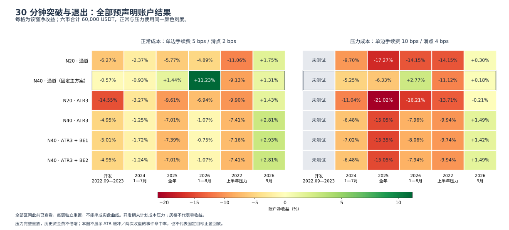

# 30 分钟通道突破：定义、准确率与退出方式的固定研究

本轮没有找到可据此确认未来正期望的 30 分钟方案。六个预先声明的账户方案在开发期全部亏损；固定主方案 `m30-n40-channel` 净收益 -0.57%，仅 3／6 币盈利，未通过至少 4 币盈利的资格。主方案保持不变，后续窗口照计划完整报告。2025 年正常成本为 +1.44%，手续费和滑点加倍后为 -6.33%；2026 年前八个月为 +11.23%／+2.77%，但主方案六窗自身日均收益的 95% 区间全部跨零。

两项问题需要分开回答。**账户交易胜率**受入场、退出、持仓和风控共同影响；**突破事件的目标先达率**只描述指定价格路径。额外确认降低了几何意义的假突破比例，却没有稳定提高先到 2R 的比例；动态 ATR 跟踪和保本提高部分窗口的账户胜率，也没有稳定改善净收益。不能从这些结果直接选一个最高胜率参数。

完整账户评价与成本压力见 [REPORT.md](REPORT.md)、[results.json](results.json)；逐笔归因见 [diagnostics.json](diagnostics.json)；事件统计与逐事件记录见 [signals.json](signals.json)、[events.jsonl.gz](events.jsonl.gz)。六窗均是已查看历史，分别重置资金，不能拼成连续实盘曲线。

## 本轮固定了什么

六币为 BTC、ETH、BNB、SOL、XRP、DOGE 的 Binance USDT 永续。各币初始 10000 USDT，总计 60000 USDT；单笔风险 0.5%、最大仓位价值比例 95%、连续 3 次亏损冷却 60 分钟、日亏损限制 3%。全部只做多，不加方向过滤、成本过滤或额外形态。正常成本每边手续费 5 bps、滑点 2 bps；压力为 10／4 bps，历史资金费率不倍增。开发窗不运行成本压力，其余每窗六方案全部完整重放压力。

| 简称                  | 精确候选 ID        | 入场窗口／退出方式               |
| --------------------- | ------------------ | -------------------------------- |
| 20 通道               | `m30-n20-channel`  | 前 20 根高点／前 10 根低点       |
| 40 通道（固定主方案） | `m30-n40-channel`  | 前 40 根高点／前 20 根低点       |
| 20 ATR3               | `m30-n20-atr3`     | 前 20 根高点／动态 ATR3          |
| 40 ATR3               | `m30-n40-atr3`     | 前 40 根高点／动态 ATR3          |
| 40 ATR3＋BE1          | `m30-n40-atr3-be1` | 前 40 根高点／动态 ATR3＋1R 保本 |
| 40 ATR3＋BE2          | `m30-n40-atr3-be2` | 前 40 根高点／动态 ATR3＋2R 保本 |

30 分钟 K 按 UTC 完整收盘。突破边界为不含当前 K 的前 N 根最高价，信号要求收盘达到该边界加一个 tick，次分钟开盘加不利滑点／取整后成交。Wilder ATR14 在信号收盘冻结，初始止损 2 ATR；初始实际入场到止损距离是 R 的价格尺度，乘数量得到美元风险。通道退出要求收盘严格低于前 N／2 根最低价，次分钟开盘退出；此前已有硬止损先检查。

ATR3 方案不是固定盈利目标，也不是每个入场瞬间立刻启用追踪。它在入场后的完整 30 分钟 K 收盘、`closeR >= 0` 时启动，此后保持激活；按入场以来的有利极值减去最新完整 K 的 3 ATR 更新，止损只收紧、不放宽，下分钟生效。新保护价跨过当前收盘时产生下分钟开盘退出意图。BE1／BE2 在完整 K 收盘达到 1R／2R 后锁定，覆盖已知入场费、已计资金费和估计退出成本；未来资金费或跳空仍可能使最终净额为负。

**计划说明勘误：**冻结计划沿用的 `limitations[0]` 写着 “Both candidate definitions…” 已在旧研究查看，这不准确描述本轮六个新 30 分钟组合。此前已查看的是全部历史窗口和前期趋势研究；本轮六组合在运行前新预声明，既有 4 小时 40 根主规则来自旧十候选研究。此文字问题在本轮审阅中发现，冻结计划保留原字节；候选、执行方式和日期均未因此改变。所有结果仍不能称为未触碰样本外或前瞻证据。

| 窗口 ID             | 起止日期（左闭右开）     | 本轮用途                       |
| ------------------- | ------------------------ | ------------------------------ |
| `development`       | 2022-09-01 至 2024-01-01 | 开发资格复核 · 已查看历史      |
| `known-2024`        | 2024-01-01 至 2024-08-01 | 2024 年 1—7 月 · 已查看历史    |
| `known-2025`        | 2025-01-01 至 2026-01-01 | 2025 全年 · 已查看历史         |
| `known-2026`        | 2026-01-01 至 2026-09-01 | 2026 年 1—8 月 · 已查看历史    |
| `historical-stress` | 2022-01-01 至 2022-07-01 | 2022 年上半年压力 · 已查看历史 |
| `fresh-september`   | 2026-09-01 至 2026-10-01 | 2026 年 9 月复核 · 已查看历史  |

窗口沿用既有研究：2022 年 7—8 月及 2024 年 8—12 月未纳入，来源是先前冻结窗口及其中已识别的 2022 年 7 月、2024 年 8 月标记价格缺口；这不表示整段遗漏月份都没有行情。`fresh-september` 只是历史 ID，2026 年 9 月现为已查看诊断，不能重新称为新样本。

## 全部账户收益与成本压力

图的两幅使用同一颜色尺度，开发压力灰格为未计划测试。下表每格为“正常／压力”净收益，均已包含交易费、滑点及取整和实际资金费；不是扣费前收益。

| 窗口            | 20 通道          | 40 通道（固定主方案） | 20 ATR3         | 40 ATR3         | 40 ATR3＋BE1    | 40 ATR3＋BE2    |
| --------------- | ---------------- | --------------------- | --------------- | --------------- | --------------- | --------------- |
| 开发期          | -6.27%／未测     | -0.57%／未测          | -14.55%／未测   | -4.95%／未测    | -5.01%／未测    | -4.95%／未测    |
| 2024 年 1—7 月  | -2.37%／-9.70%   | -0.93%／-5.25%        | -3.27%／-11.04% | -1.25%／-6.48%  | -1.72%／-7.02%  | -1.24%／-6.48%  |
| 2025 全年       | -5.77%／-17.27%  | 1.44%／-6.33%         | -9.61%／-21.02% | -7.01%／-15.05% | -7.39%／-15.35% | -7.01%／-15.05% |
| 2026 年 1—8 月  | -4.89%／-14.15%  | 11.23%／2.77%         | -6.94%／-16.21% | -1.07%／-7.96%  | -0.75%／-8.06%  | -1.07%／-7.94%  |
| 2022 上半年压力 | -11.06%／-14.15% | -9.13%／-11.12%       | -9.90%／-13.71% | -7.41%／-9.94%  | -7.16%／-9.74%  | -7.41%／-9.94%  |
| 2026 年 9 月    | 1.75%／0.30%     | 1.31%／0.18%          | 1.43%／-0.21%   | 2.81%／1.49%    | 2.93%／1.42%    | 2.81%／1.49%    |

2024 年和 2022 压力窗，所有正常及压力方案均亏损。2025 年只有正常成本的 40 通道微利，压力后六方案全部亏损；2026 年只有 40 通道在两种成本下盈利。9 月六方案正常成本均正，ATR／保本部分结果更高，但只有 30 个完整日，且日期此前已查看；不能用这一窗替换固定主方案。

开发资格失败不是缺少交易：主方案六币分别 187、205、214、209、188、216 笔，均超过预定每币 30 笔，487 个完整日、Sharpe 可定义、币种平均净 R 中位数 +0.0104；只有盈利币数未达 4／6。该描述性资格本身不构成显著性检验。完整曲线见 [六窗账户权益图](equity.svg)。

| 主方案窗口      | 笔数 | 净胜率 | 净 PF | 单笔平均净收益 USDT | 平均净 R | 日终最大回撤 |
| --------------- | ---- | ------ | ----- | ------------------- | -------- | ------------ |
| 开发期          | 1219 | 23.38% | 0.992 | -0.28               | -0.0099  | -9.91%       |
| 2024 年 1—7 月  | 575  | 28.00% | 0.970 | -0.97               | -0.0212  | -7.49%       |
| 2025 全年       | 1007 | 26.81% | 1.026 | 0.86                | 0.0167   | -7.28%       |
| 2026 年 1—8 月  | 604  | 24.01% | 1.326 | 11.16               | 0.3088   | -8.96%       |
| 2022 上半年压力 | 443  | 23.25% | 0.599 | -12.37              | -0.2776  | -9.92%       |
| 2026 年 9 月    | 83   | 30.12% | 1.297 | 9.44                | 0.2028   | -2.42%       |

## 胜率提高，为何没有变成更高收益

净胜率为最终净收益严格大于零的完成交易数占比；PF 为正净收益总和除以负净收益绝对总和。平均盈利／亏损和胜率需要同时看，保本附近微利也会计作胜单。以下对比使用同币、同窗、同资金及成本假设，但退出变化会改变后续入场和风控路径，并非只在同一组交易上移动止损。

| 窗口           | 方案                  | 笔数 | 净胜率 | 平均盈利 USDT | 平均亏损 USDT | 平均盈亏比 | 净 PF | 平均净 R | 持仓中位小时 |
| -------------- | --------------------- | ---- | ------ | ------------- | ------------- | ---------- | ----- | -------- | ------------ |
| 2025 全年      | 40 通道（固定主方案） | 1007 | 26.81% | 124.24        | -44.34        | 2.802      | 1.026 | 0.0167   | 11.00        |
| 2025 全年      | 40 ATR3               | 1272 | 30.90% | 68.67         | -35.49        | 1.935      | 0.865 | -0.0827  | 5.95         |
| 2025 全年      | 40 ATR3＋BE1          | 1289 | 37.47% | 54.02         | -37.87        | 1.426      | 0.855 | -0.0855  | 5.78         |
| 2026 年 1—8 月 | 40 通道（固定主方案） | 604  | 24.01% | 188.83        | -44.97        | 4.199      | 1.326 | 0.3088   | 8.71         |
| 2026 年 1—8 月 | 40 ATR3               | 756  | 30.69% | 81.41         | -37.27        | 2.184      | 0.967 | -0.0178  | 5.82         |
| 2026 年 1—8 月 | 40 ATR3＋BE1          | 761  | 36.66% | 66.81         | -39.61        | 1.687      | 0.976 | -0.0126  | 5.55         |

2025 年，40 通道改为 ATR3 后净胜率从 26.81% 升到 30.90%，但平均盈利由 124.24 降至 68.67 USDT，净 PF 从 1.026 降到 0.865。再加 1R 保本，胜率升至 37.47%，平均盈利降至 54.02 USDT，净 PF 为 0.855。2026 年也出现更高胜率伴随更低平均盈利与较差净收益。这里的证据支持“胜率不能独立评价”，不能证明提前退出在每个市场必然有害。原始研究也表明，趋势系统的赢亏频率与收益分布形状会分离；其零漂移模型并未证明本策略有收益优势。[Potters 与 Bouchaud 原论文](https://arxiv.org/abs/physics/0508104)

退出结构与此一致：2025 年 40 通道有 555 次初始止损、451 次通道退出、1 次区间末平仓；40 ATR3 有 406 次初始止损、858 次追踪退出、8 次新保护价跨收盘退出；加 BE1 后为 411／766／7 次，另有 105 次保本退出。持仓中位数由 11.00 小时降至 5.95／5.78 小时。不能把这些退出后的行情当成已实现盈利，完成交易自身 MFE／MAE 截止于真实退出，也不能拿来代替固定 12 小时的事件观测。

**2R 保本在现有 ATR3 跟踪下大多冗余。**正常成本 40 ATR3 与 BE2 在开发、2025、2026、2022 压力、9 月的全部交易字段逐笔相同，分别为 1454、1272、756、535、101 笔。2024 年 709 笔中只有 BTC 4 笔字段不同，入退场时刻都未变：第 40 笔由追踪退出变为保本退出，成交价 69053.5 → 69095.3，净额 -4.2919 → +0.0114 USDT；后 3 笔仅有先前现金变化引起的数量／成本／净额差异。压力情景存在少量差异，因此“通常冗余”限于本规则与这些账本，不能声称 2R 保本在所有路径完全无效。

## 成本与尾部：需要保留什么

成本 R =（手续费＋资金费＋滑点及取整）／每笔初始实际美元风险。以下为主方案正常成本的原成交账本归因，成本前值减成本总和等于净额；成本前值不是零费用策略的重新回放。全部费用已嵌入账户评价，不再重复扣除。

| 窗口            | 成本前值 USDT | 手续费   | 滑点及取整 | 资金费 | 成本总和 | 净额      | 平均成本前 R | 平均成本 R |
| --------------- | ------------- | -------- | ---------- | ------ | -------- | --------- | ------------ | ---------- |
| 开发期          | 7,640.35      | 5,188.65 | 2,380.17   | 411.73 | 7,980.55 | -340.20   | 0.1473       | 0.1572     |
| 2024 年 1—7 月  | 3,191.48      | 2,233.08 | 1,017.09   | 499.84 | 3,750.01 | -558.53   | 0.1269       | 0.1481     |
| 2025 全年       | 7,061.52      | 4,120.13 | 1,715.12   | 362.24 | 6,197.48 | 864.04    | 0.1596       | 0.1430     |
| 2026 年 1—8 月  | 11,169.87     | 2,911.66 | 1,248.32   | 271.33 | 4,431.31 | 6,738.57  | 0.4842       | 0.1754     |
| 2022 上半年压力 | -3,680.44     | 1,216.29 | 535.22     | 46.19  | 1,797.71 | -5,478.15 | -0.1847      | 0.0929     |
| 2026 年 9 月    | 1,349.43      | 365.55   | 152.48     | 48.00  | 566.04   | 783.39    | 0.3591       | 0.1563     |

开发期和 2024 年主方案成本前值为正，却不足以覆盖成本；2025 年毛收益优势仅略高于成本，因此双倍费滑的完整回放转亏。2022 压力窗成本前值已经为负，不能全归因于费用。2026 年成本前值较高、压力后仍正，只是该历史窗的结果。压力回放会改变成交、数量、保本和后续路径，不能简单将原账本成本再扣一次。

下表的“最盈利 5%”以该窗全部完成交易数的 5% 向上取整，再取其中正收益最大的交易；贡献分母为全部正净收益，而非总净额。

| 主方案窗口      | 最盈利 5% 贡献正利润 | 移除这些盈利后的原账本净额 USDT | 持仓中位小时 |
| --------------- | -------------------- | ------------------------------- | ------------ |
| 开发期          | 65.38%               | -27,211.70                      | 9.20         |
| 2024 年 1—7 月  | 51.66%               | -9,996.62                       | 11.00        |
| 2025 全年       | 59.40%               | -19,061.50                      | 11.00        |
| 2026 年 1—8 月  | 72.54%               | -13,123.46                      | 8.71         |
| 2022 上半年压力 | 59.08%               | -10,318.76                      | 10.07        |
| 2026 年 9 月    | 37.29%               | -491.66                         | 8.32         |

移除右尾后的账本净额六窗均为负，说明少数大盈利对结果重要；这不是可执行的反事实回放，也不是自动淘汰标准。通道持有大趋势时会回吐部分浮盈，跟踪／固定目标可以改变回吐，但也会截短未来延伸。原海龟规则明确采用不同入场和反向通道退出窗口，并接受部分利润回吐；原规则使用盘中突破，本轮改用收盘确认，市场与周期也不同，不能援引其名气证明 Binance 30 分钟有效。[原参与者公开的海龟规则](https://www.tradingblox.com/originalturtles/originalturtlerules.pdf)

作为既有参照，4 小时 40 根包含 **160 小时**，30 分钟 40 根只含 **20 小时**；ATR14 与退出 20 根的物理时长也一起缩短。2025 年旧 4 小时主方案为 107 笔、平均成本前 R +0.4712、成本 R 0.0741、净 R +0.3971、持仓中位 96 小时；本轮 30 分钟主方案为 1007 笔、+0.1596／0.1430／+0.0167、11 小时。这里只引用[已冻结四小时诊断](../channel-recheck/diagnostics.json)，没有新跑 4 小时，也不能将差异单独归因于某一入场阈值。更短周期并不自动提供更多有效独立样本。

## 预声明配对比较与不确定性

账户区间采用同一天两方案的日收益差，7 日日历块、2000 次重抽样，种子 20261003。下表单位为每日 bps；各格为差值均值及 95% 配对区间。“40－20 通道”同时改变入场与退出长度；“同退出 40－20”保持 ATR3 退出，但仍会改变完整持仓和风控路径。

| 窗口            | 主方案自身日均 95% 区间 | 40－20 通道              | ATR3－40 通道           | 同退出 40－20          | BE1－ATR3              | BE2－ATR3             |
| --------------- | ----------------------- | ------------------------ | ----------------------- | ---------------------- | ---------------------- | --------------------- |
| 开发期          | [-4.612, 5.150]         | 1.180 [-0.831, 3.093]    | -1.065 [-4.086, 1.776]  | 2.147 [0.722, 3.423]   | -0.014 [-0.210, 0.181] | 0.000 [0.000, 0.000]  |
| 2024 年 1—7 月  | [-5.633, 5.662]         | 0.670 [-2.850, 4.208]    | -0.199 [-4.226, 3.174]  | 0.935 [-1.413, 3.259]  | -0.226 [-0.736, 0.196] | 0.003 [-0.001, 0.010] |
| 2025 全年       | [-4.241, 5.702]         | 2.019 [-0.349, 4.305]    | -2.447 [-5.318, 0.259]  | 0.752 [-0.810, 2.469]  | -0.114 [-0.507, 0.209] | 0.000 [0.000, 0.000]  |
| 2026 年 1—8 月  | [-5.980, 19.959]        | 6.568 [1.138, 13.995]    | -5.085 [-15.585, 2.687] | 2.473 [0.307, 4.735]   | 0.130 [-0.143, 0.385]  | 0.000 [0.000, 0.000]  |
| 2022 上半年压力 | [-9.812, 0.111]         | 1.181 [-2.181, 4.378]    | 0.991 [-2.032, 3.703]   | 1.477 [-1.446, 4.233]  | 0.147 [0.030, 0.270]   | 0.000 [0.000, 0.000]  |
| 2026 年 9 月    | [-14.363, 24.078]       | -1.583 [-15.473, 12.091] | 4.847 [-3.353, 13.137]  | 4.462 [-2.889, 12.354] | 0.382 [-0.292, 1.054]  | 0.000 [0.000, 0.000]  |

主方案自身六窗区间均跨零；ATR3 相对 40 通道的六窗配对区间也均跨零。2026 年 40 通道相对 20 通道、以及部分同退出周期对照区间在零上方，只支持相应已看窗口的描述；BE1 在 2022 压力窗的微小正差也没有令账户盈利。所有区间未校正本轮多个比较及此前研究尝试，不构成未来显著优势。BE2 的零区间来自相同历史账本，不代表未来差异没有不确定性。

## “突破准确率”先定义分母与成功事件

通道突破没有唯一的成交定义。TradingView 官方 Channel BreakOut 使用前通道极值之外一 tick 的突破，原海龟为盘中触及；**本轮完整收盘确认**是明确的额外选择。缓冲和两次收盘确认没有作为原生账户策略回放，只用于以下有限事件研究。[TradingView 官方定义](https://www.tradingview.com/support/solutions/43000599828-channel-breakout-strategy/)

事件按每币／窗口／N 独立构造：第一次完整收盘达到前 N 根高点加 tick，开始一个 episode（首次突破片段），冻结初次边界 U；直到以后另一根收盘回到 U 或以下才重新允许下一个片段，重置当根不能同时启动。因此片段可以跨过很长趋势。全部 30891 个原始合格收盘归为 3541 个唯一片段；2025 年 N40 为 3473 个原始合格收盘、326 个片段。**这里的覆盖率以首次片段为分母，不是全部原生交易机会覆盖率，也不是所有突破的准确率。**实际账户该年主方案完成 1007 笔、净胜率 26.81%，不能与 326 个事件混算。

三定义共享片段起点：单次收盘接受第一次突破；0.25 ATR 缓冲仅在同一根首次信号 K 达到 `U + max(tick, 0.25 ATR)` 才接受，不等后续更强突破；连续两次收盘只检查紧接的下一根仍达到第一次冻结 U 加 tick，采用第二根 ATR 和随后分钟开盘。它不是第二根相对其新滚动通道再创新高。

每个被接受事件以次分钟开盘不利滑点／取整构造参考入场、初始 2 ATR 止损和实际 R，不配置资金或持仓约束，也不计算资金费和净收益。向后完整 24 根 30 分钟，即 12 小时，逐分钟判断 +1R／+2R 是否先于 -1R；开盘先判断，分钟高低同时触及则标歧义并给上下界。完整期限没有触及任一端标为未触达，不算亏损；样本尾端不够完整期限则排除并另报。先达率分母保留所有完整期限事件，不能只挑已经触及目标／止损的样本。

“几何假突破”另定义为其后四根完整 30 分钟 K 中有收盘回到 U 或以下，它不是止损标签，不能与先达目标互斥分类。2025 年 N40 单次收盘有 15 个片段同时满足几何假突破和先到 +2R；这里只表示共现，不推断二者先后。MFE／MAE 观察完整 12 小时，不在首次触及目标、止损或账户退出时截断。

| 2025 年 N40 定义 | 接受／基准片段 | 覆盖率  | 几何假突破 | 先 +1R | 先 +2R | +2R 目标／止损／未触达 | 先 +2R 的 95% 边际区间 |
| ---------------- | -------------- | ------- | ---------- | ------ | ------ | ---------------------- | ---------------------- |
| 单次收盘         | 326/326        | 100.00% | 53.99%     | 41.72% | 16.56% | 54/158/114             | [10.49, 24.83]%        |
| 0.25 ATR 缓冲    | 194/326        | 59.51%  | 43.30%     | 41.75% | 16.49% | 32/100/62              | [10.05, 24.72]%        |
| 连续两次收盘     | 216/326        | 66.26%  | 37.04%     | 36.11% | 19.91% | 43/116/57              | [13.15, 27.59]%        |

2025 年单次收盘有 114／326＝34.97% 在 12 小时内没有先到 +2R 或 -1R；因此 16.56% 不能直接与“2R 盈亏比只需 1／3 胜率”比较。那个简式要求二元、固定净盈亏的终局，本事件有期限未触达、不同退出时间、成本和跳空边界，且未模拟固定目标账户。缓冲将覆盖降至 59.51%，几何假突破下降，+2R 先达率几乎不变；两次确认覆盖 66.26%、+2R 先达率升至 19.91%，但 +1R 先达率从 41.72% 降至 36.11%。两次确认的四根假突破窗口也从第二根确认后开始；延迟确认同时改变入场价、ATR、观察窗口和剩余机会，不能只归因于“过滤噪声”。

效果在其他窗口反转：N40 两次确认的 +2R 先达率，开发期为 16.27% 对单次 18.56%，2026 年为 19.83% 对 23.50%。2026 年缓冲的条件比例提高至 25.24%，却只保留 313／468 个片段，跳过 31 个按原单次定义先到 +2R 的赢家，另跳过 85 个止损、39 个未触达片段。覆盖率、跳过赢家与条件比例必须一起读，不能把少出手自动当作更强入场。

主表保留全部片段，允许不同事件未来区间重叠；另有预先声明的共同非重叠敏感性样本，按起点顺序选取，并锁至可能第二次确认入场后的完整期限，不依赖未来盈亏。全体 3541 片段中保留 2591 个；这不是独立同分布保证。结果会改变：2024 年 N40 两次确认对单次先 +2R 的差，从全部片段 -0.52 个百分点变为非重叠样本 +4.08；2025 年 N20 从 +1.07 变为 -0.88。全量／非重叠、逐币及未触达统计均保留在 signals.json，不选择有利子样本。

事件区间也按 7 日日历块重抽样，六币同日共同抽取；它们是各定义比例的边际区间，**不是定义之差的配对区间**，不能通过两区间重叠与否判断差异显著。本轮已发布事件的同分钟触及歧义计数为零，但方法仍保留该边界；2022 压力窗存在尾端完整期限不足及两次确认不足的片段，单独列出，未伪装成止损。

六窗 × N20／40 × 三定义的全部片段事件表

下表“先 1R／2R”均以完整 12 小时事件为分母；尾排除列是已接受但未来期限不足，确认尾缺则是未能观察下一根确认。所有逐币、共享非重叠与区间仍见 signals.json。

| 窗口            | N   | 定义         | 接受／片段 | 覆盖    | 完整期限 | 假突破 | 先 1R  | 先 2R  | 2R 目标／止损／未触达 | 尾排除／确认尾缺 |
| --------------- | --- | ------------ | ---------- | ------- | -------- | ------ | ------ | ------ | --------------------- | ---------------- |
| 开发期          | 20  | close-tick   | 337/337    | 100.00% | 337      | 52.23% | 45.40% | 15.43% | 52/165/120            | 0/0              |
| 开发期          | 20  | close-buffer | 217/337    | 64.39%  | 217      | 44.24% | 45.62% | 12.44% | 27/112/78             | 0/0              |
| 开发期          | 20  | two-close    | 234/337    | 69.44%  | 234      | 35.47% | 40.60% | 16.67% | 39/111/84             | 0/0              |
| 开发期          | 40  | close-tick   | 291/291    | 100.00% | 291      | 51.20% | 43.64% | 18.56% | 54/146/91             | 0/0              |
| 开发期          | 40  | close-buffer | 204/291    | 70.10%  | 204      | 43.63% | 42.65% | 16.67% | 34/107/63             | 0/0              |
| 开发期          | 40  | two-close    | 209/291    | 71.82%  | 209      | 36.84% | 34.93% | 16.27% | 34/102/73             | 0/0              |
| 2024 年 1—7 月  | 20  | close-tick   | 161/161    | 100.00% | 161      | 52.80% | 40.99% | 22.98% | 37/82/42              | 0/0              |
| 2024 年 1—7 月  | 20  | close-buffer | 95/161     | 59.01%  | 95       | 37.89% | 45.26% | 25.26% | 24/46/25              | 0/0              |
| 2024 年 1—7 月  | 20  | two-close    | 112/161    | 69.57%  | 112      | 39.29% | 42.86% | 23.21% | 26/50/36              | 0/0              |
| 2024 年 1—7 月  | 40  | close-tick   | 124/124    | 100.00% | 124      | 49.19% | 46.77% | 25.81% | 32/61/31              | 0/0              |
| 2024 年 1—7 月  | 40  | close-buffer | 80/124     | 64.52%  | 80       | 37.50% | 47.50% | 27.50% | 22/36/22              | 0/0              |
| 2024 年 1—7 月  | 40  | two-close    | 87/124     | 70.16%  | 87       | 36.78% | 51.72% | 25.29% | 22/41/24              | 0/0              |
| 2025 全年       | 20  | close-tick   | 393/393    | 100.00% | 393      | 53.94% | 46.31% | 15.01% | 59/181/153            | 0/0              |
| 2025 全年       | 20  | close-buffer | 235/393    | 59.80%  | 235      | 41.70% | 45.53% | 14.89% | 35/115/85             | 0/0              |
| 2025 全年       | 20  | two-close    | 255/393    | 64.89%  | 255      | 34.51% | 44.31% | 16.08% | 41/125/89             | 0/0              |
| 2025 全年       | 40  | close-tick   | 326/326    | 100.00% | 326      | 53.99% | 41.72% | 16.56% | 54/158/114            | 0/0              |
| 2025 全年       | 40  | close-buffer | 194/326    | 59.51%  | 194      | 43.30% | 41.75% | 16.49% | 32/100/62             | 0/0              |
| 2025 全年       | 40  | two-close    | 216/326    | 66.26%  | 216      | 37.04% | 36.11% | 19.91% | 43/116/57             | 0/0              |
| 2026 年 1—8 月  | 20  | close-tick   | 540/540    | 100.00% | 540      | 56.48% | 44.63% | 22.41% | 121/254/165           | 0/0              |
| 2026 年 1—8 月  | 20  | close-buffer | 330/540    | 61.11%  | 330      | 44.85% | 47.58% | 23.64% | 78/152/100            | 0/0              |
| 2026 年 1—8 月  | 20  | two-close    | 375/540    | 69.44%  | 375      | 40.80% | 44.53% | 22.13% | 83/178/114            | 0/0              |
| 2026 年 1—8 月  | 40  | close-tick   | 468/468    | 100.00% | 468      | 51.28% | 45.73% | 23.50% | 110/234/124           | 0/0              |
| 2026 年 1—8 月  | 40  | close-buffer | 313/468    | 66.88%  | 313      | 41.21% | 47.60% | 25.24% | 79/149/85             | 0/0              |
| 2026 年 1—8 月  | 40  | two-close    | 343/468    | 73.29%  | 343      | 38.19% | 45.48% | 19.83% | 68/162/113            | 0/0              |
| 2022 上半年压力 | 20  | close-tick   | 446/446    | 100.00% | 442      | 50.90% | 39.59% | 14.71% | 65/232/145            | 4/0              |
| 2022 上半年压力 | 20  | close-buffer | 265/446    | 59.42%  | 261      | 40.23% | 38.70% | 15.33% | 40/141/80             | 4/0              |
| 2022 上半年压力 | 20  | two-close    | 321/446    | 71.97%  | 320      | 39.06% | 37.19% | 13.44% | 43/168/109            | 1/3              |
| 2022 上半年压力 | 40  | close-tick   | 335/335    | 100.00% | 334      | 49.70% | 42.81% | 16.17% | 54/176/104            | 1/0              |
| 2022 上半年压力 | 40  | close-buffer | 213/335    | 63.58%  | 212      | 38.68% | 46.23% | 19.81% | 42/108/62             | 1/0              |
| 2022 上半年压力 | 40  | two-close    | 254/335    | 75.82%  | 254      | 40.16% | 37.40% | 15.35% | 39/136/79             | 0/1              |
| 2026 年 9 月    | 20  | close-tick   | 66/66      | 100.00% | 66       | 71.21% | 51.52% | 34.85% | 23/27/16              | 0/0              |
| 2026 年 9 月    | 20  | close-buffer | 38/66      | 57.58%  | 38       | 57.89% | 55.26% | 39.47% | 15/18/5               | 0/0              |
| 2026 年 9 月    | 20  | two-close    | 34/66      | 51.52%  | 34       | 44.12% | 61.76% | 44.12% | 15/14/5               | 0/0              |
| 2026 年 9 月    | 40  | close-tick   | 54/54      | 100.00% | 54       | 62.96% | 64.81% | 42.59% | 23/16/15              | 0/0              |
| 2026 年 9 月    | 40  | close-buffer | 34/54      | 62.96%  | 34       | 47.06% | 64.71% | 44.12% | 15/13/6               | 0/0              |
| 2026 年 9 月    | 40  | two-close    | 29/54      | 53.70%  | 29       | 34.48% | 72.41% | 48.28% | 14/10/5               | 0/0              |

## 止盈决策的边界与下一步

本轮实测的是反向通道、动态 ATR 跟踪及附加保本，**没有运行固定 +1R／+2R 止盈账户，也没有 buffer／two-close 的净收益账户**。目标先达事件只能帮助定义下一次可检验的问题；不能将先达比例乘固定盈亏比直接得到当前账户预期收益，更不能发布这三事件定义的“净收益排名”。

Chandelier 官方定义使用指定回看窗口内的最高价减 ATR 倍数；本实现使用入场以来极值、完整收盘激活、动态 ATR、单调收紧与次分钟执行，属于有明确差别的变体。[TradingView Chandelier 官方说明](https://www.tradingview.com/support/solutions/43000773013-chandelier-exit/) 固定目标会预先封顶部分大行情，通道和追踪容许更长延伸但可能回吐；本轮账本已显示右尾的重要性，尚未证明哪个固定目标更优。

因此本轮保留失败资格和所有对照，不从 9 月、较高胜率或某一个先达率挑赢家。若继续验证，需要先固定实际可成交的入退场规则、期限未触达如何平仓及成本，再使用新获得的数据检验；这里没有因此追加参数或回放。Binance 永续结果也不能外推原油期货的交易时段、跳空、合约换月和订单成交机制。

## 证据身份与校验范围

本轮计划 SHA256 为 `b3e2ad3f442df8641422b7b59d4b83bff4b4b62aa0e6ee83ddfada8ee5d23a70`；manifest 为 `5b17ed79680d6f42506c60fe68a21c413d167feaaee867c2e34789c7ba13dcc4`；原生执行器 `trend-continuation-13`，二进制为 `5c4f7be9e419c8dcc498ab7ab8fb8830b361d336b5029f0af7872c35ffa2b0bd`。结果、收据、来源 CSV／资金费和规范日权益已审计；新报告只读取既有运行，没有修改旧冻结研究。

[独立执行审计](execution-audit.json)覆盖 36 批、396 行、54672 笔完成交易（包括压力重复，这不是独立样本数）：全部核对原始 CSV 的 30 分钟聚合、信号 ATR／前 N 高点、次分钟开盘、初始止损、数量、费用资金费及现金账本；其中 29952 笔核对可直接从原始行情得到的退出价。另外按币种／方案／成本及退出原因选取 108 笔 staged 交易，逐分钟完整重建有利极值、closeR 激活、保本成本、动态 ATR3、单调止损和跨收盘意图，退出时刻／原因／成交价一致（48 次追踪、45 次保护价跨收盘、15 次保本）。这不表示全部 54672 笔都做了完整止损演进重建。

独立事件审计从压缩逐事件账本重建了 3541 个唯一片段、72 个币种／窗口／N 分组、504 个汇总及 1008 个目标单元，计数、覆盖、MFE／MAE、跳过事件与非重叠锁均一致，并核对原生 54672 个交易信号快照。诊断另外验证每笔实际风险与净 R、成本前值减成本等于净额，再与统一账户评价对账。统一 Python 测试 57 项通过，覆盖事件标签与研究协议边界。数值正确和可复现不能替代策略有效性的证据。
